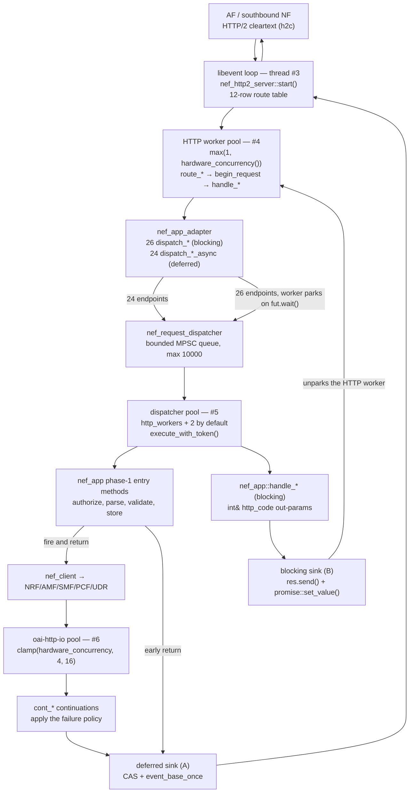
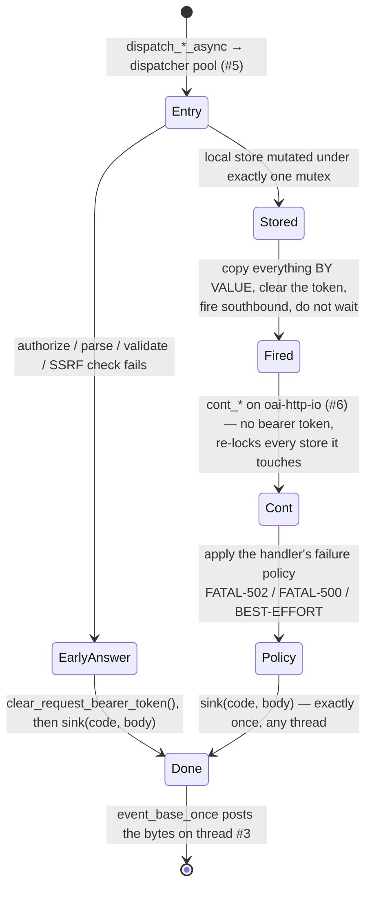

<!-- SPDX-License-Identifier: CC-BY-4.0 -->

# OAI NEF — Architecture

The Network Exposure Function sits at the edge of the 5G core. Northbound it serves REST APIs to
Application Functions and SCS/AS clients; southbound it turns those calls into SBI requests to the
NRF, AMF, SMF, PCF and UDR, and relays the notifications that come back.

This page is about the binary that does that: how a request travels through it, which threads run
which part of it, and which invariants the code relies on but the compiler does not enforce. It is
a map, not a specification.

## Where to start

You probably do not need all twelve sections. Pick the entry that matches what you are doing:

- **New to the codebase** — §1 for the layer stack, then §2 for the life of a request.
- **A request hangs or never answers** — §4 tells you whether that endpoint is blocking or
  deferred, §8 gives the two ways a response sink can fail, and §7.1 says which thread is parked.
- **Adding an endpoint** — §3 (register the route), §4 (choose blocking or async), §5 (the
  phase-1 / `cont_*` convention, if async), §6 (which `.cpp` file it belongs in).
- **Touching locking, or adding state to `nef_app`** — read §7.2 before anything else. There is a
  latent deadlock in the tree that only block scoping keeps latent.
- **Changing anything on the async path** — §5 and §9. The `thread_local` bearer token has an
  ordering rule that the obvious refactor breaks.
- **Authorization or JWT questions** — §9, including the open question recorded at the end of it.
- **A guard script failed in CI** — §11 says what each one pins and how to run it locally.
- **Deciding whether behaviour is missing or broken** — §12 lists what is known to be absent.

## Where the contracts live

Wherever the source already carries a contract comment, this page points at it rather than
restating it. The comment next to the code is the normative copy, because it is the one that gets
updated when the code changes.

| Contract | Where it lives |
|---|---|
| The ten-mutex concurrency contract | `src/nef_app/nef_app.hpp`, immediately above the private state block |
| The two `response_sink` contracts | `src/common/nef_request_task.hpp`, above the `using` declaration |
| The async phase-1 / `cont_*` split | `src/nef_app/nef_app_internal.hpp`, the banner at the end of the file |
| The `thread_local` bearer-token discipline | `src/nef_app/nef_app_core.cpp`, above `g_request_bearer_token` |
| Route-table ordering | `src/api-server/nef-http2-server.cpp`, inside `nef_http2_server::start()` |
| Dispatcher pool sizing and the no-self-enqueue rule | `src/nef_app/nef_request_dispatcher.hpp`, above the class |
| Deferred-sink lifecycle | `src/nef_app/nef_app_adapter.cpp`, above the `make_deferred_*_sink` helpers |

For the northbound REST surface — paths, payloads, status codes — see
[`docs/api-reference/`](api-reference/overview.md). For the generated 3GPP model layer, see
[`GENERATED-CODE.md`](GENERATED-CODE.md).

All counts on this page were measured against the tree at the time of writing. Where a number is
load-bearing, the command that produces it is given so it can be re-derived.

---

## 1. The layers

NEF is a single binary with a conventional stack: an HTTP/2 front end, a queue and worker pool in
the middle, one large business-logic class, and an SBI client at the back. The table below is the
map from "layer" to "file you open".

```
main()  ─► nef_config ─► http_client ─► nef_event ─► nef_app ─► task_manager ─► nef_http2_server
                                                        │                               │
                                                nef_client (southbound)      nef_app_adapter (dispatch)
```

| Layer | Class | Files |
|---|---|---|
| Entry point, signal handling, PID file | `main()` | `src/oai-nef/main.cpp` |
| CLI options | `Options` | `src/oai-nef/options.{cpp,hpp}` |
| HTTP/2 server (nghttp2, h2c) | `oai::nef::api::nef_http2_server` | `src/api-server/nef-http2-server.{h,cpp}`, wrapping `oai::sba::http2_server` from the `src/common-src` submodule |
| Dispatch facade | `oai::nef::app::nef_app_adapter` | `src/nef_app/nef_app_adapter.{hpp,cpp}` |
| Bounded request queue + worker pool | `oai::nef::app::nef_request_dispatcher` | `src/nef_app/nef_request_dispatcher.hpp` (header-only) |
| Business logic and all in-memory state | `oai::nef::app::nef_app` | `src/nef_app/nef_app.hpp` + eight `nef_app_*.cpp` translation units (§6) |
| Southbound SBI client | `oai::nef::app::nef_client` | `src/nef_app/nef_client.{hpp,cpp}` — NRF, AMF, SMF, PCF, UDR |
| Notification fan-out to AFs | `notification_thread_pool` | `src/nef_app/nef_notification_queue.hpp` |
| Configuration (YAML) | `oai::config::nef::nef_config` | `src/nef_app/nef_config.hpp`, `nef_config_types.cpp`, reading `etc/config.yaml` |
| Cross-cutting helpers | 18 header files, zero `.cpp` (the target is an INTERFACE library) | `src/common/` |

One boundary in that table is enforced rather than merely intended. `nef_app_adapter` is **the only
class with request-path access to `nef_app`**. `nef_http2_server` keeps a `nef_app` pointer for
non-request health and metadata use, but route handlers must go through the adapter.
`test/nef_async_dispatch_static_guard.sh` machine-checks that property, so a shortcut from a route
handler straight into `nef_app` fails the build's test stage rather than merely reading oddly.

---

## 2. The request path

A request crosses three thread boundaries between the socket and the answer. Knowing which
boundary you are on tells you what you are allowed to capture, what is still on the stack, and
which thread will write the bytes.



Read it as three hand-offs:

1. **libevent thread → HTTP worker.** `oai::sba::http2_server` accepts the stream on its own
   libevent loop and hands the request to a worker. The worker runs the matching `route_*`
   member, which parses the path itself and calls one `handle_*` member.
2. **HTTP worker → dispatcher worker.** Every `handle_*` calls exactly one `m_adapter->dispatch_*`.
   That enqueues a `std::function<void()>` which has already captured the bearer token and the
   response sink **by value**, so no stack reference and no thread-local crosses the boundary.
3. **Dispatcher worker → `oai-http-io`** — for the 24 async endpoints only. The phase-1 method
   fires the southbound request and returns; the answer is produced later by a `cont_*`
   continuation on an Asio I/O thread.

The final bytes are always written on the libevent thread (#3): the deferred sink posts delivery
there with `event_base_once`, and the blocking sink's `res.send()` goes through the same server.

---

## 3. The route table

All routing happens in one place. `nef_http2_server::start()` is a listen log, the base-path
construction, a twelve-row table, a registration loop and the adapter construction. Each row is a
path prefix and a pointer to a `route_*` member defined directly below it.

| # | Prefix | Route member | Spec |
|---|---|---|---|
| 1 | `/nnef-eventexposure/v1/subscriptions` | `route_nnef_event_exposure` | TS 29.591 |
| 2 | `/3gpp-monitoring-event/v1/` | `route_monitoring_event` | TS 29.122 |
| 3 | `/3gpp-traffic-influence/v1/` | `route_traffic_influence` | TS 29.522 |
| 4 | `/3gpp-pfd-management/v1/` | `route_pfd_management` | TS 29.122 (T8) |
| 5 | `/nnef-pfdmanagement/v1/transactions` | `route_nnef_pfd_transactions` | TS 29.551 |
| 6 | `/nnef-pfdmanagement/v1/applications` | `route_nnef_pfd_applications` | TS 29.551 |
| 7 | `/nnef-pfdmanagement/v1/subscriptions` | `route_nnef_pfd_subscriptions` | TS 29.551 |
| 8 | `/3gpp-bdt/v1/` | `route_bdt` | TS 29.122 §5.13 |
| 9 | `/3gpp-as-session-with-qos/v1/` | `route_qos_monitoring` | TS 29.122 |
| 10 | `/3gpp-analyticsexposure/v1/` | `route_analytics` | TS 29.522 |
| 11 | `/nef-notify/v1/notify` | `route_nf_notify` | inbound southbound-NF notifications |
| 12 | `/health` | `route_health` | operational |

Base paths are built once in `build_api_base_paths()` from `nef_sbi_helper::*Base + api_version`;
none of the twelve rows contains a literal path.

**Row order is part of the contract.** `oai::sba::http2_server` matches by prefix and sorts
longest-prefix-first with a *non-stable* `std::sort`, so equal-length prefixes fall back to
registration order. Append new rows; do not reorder these to group services together.

Every route except `/health` starts with `begin_request()`, which does three things and nothing
else: extract the bearer token, reject with 503 if the server is draining, reject if rate-limited.
`/health` deliberately bypasses all three, so that a draining or saturated NEF still reports its
state to an orchestrator.

Beyond `begin_request()`, the twelve routes share nothing. They use three different prefix-strip
strategies and read different segment indices out of the split, so a change to one route's path
handling tells you nothing about the others.

---

## 4. Two request architectures behind one facade

Fifty endpoints are routed, and they are not all the same shape underneath. **Twenty-four are
genuinely asynchronous; twenty-six are synchronous under an asynchronous-looking facade.** Nothing
in the type system says which is which — the call path does, so this is the first thing to
establish when a request misbehaves.

| | Async (deferred) | Sync (blocking) |
|---|---|---|
| Endpoints | 24 | 26 |
| Adapter entry | `dispatch_*_async` | `dispatch_*` |
| HTTP worker | returns immediately | parks on `fut.wait()`, **no timeout** |
| `nef_app` method | phase-1 entry + `cont_*` | `handle_*` with `int& http_code` out-params |
| Sink family | (A) deferred | (B) blocking |
| Response written | later, by the deferred handle | inline, before the worker unparks |

Re-derive the split with:

```bash
grep -oE 'm_adapter->[a-z0-9_]+\(' src/api-server/nef-http2-server.cpp | sort -u
```

51 unique entries: 24 `_async`, 26 blocking, plus `stop()`.

### 4.1 Mode per endpoint

Grouped by route, in the route table's order. `A` = async/deferred, `S` = sync/blocking.

| Route | Handlers |
|---|---|
| `route_nnef_event_exposure` | S `handle_nnef_event_exposure_subscribe` · S `..._unsubscribe` · S `..._get` · S `..._update` |
| `route_monitoring_event` | **A** `handle_monitoring_event_subscribe` · **A** `..._unsubscribe` · S `..._get` · S `..._update` |
| `route_traffic_influence` | **A** `handle_ti_create` · **A** `handle_ti_update` · **A** `handle_ti_patch` · **A** `handle_ti_delete` · S `handle_ti_get` · S `handle_ti_list` |
| `route_pfd_management` | **A** `handle_pfd_app_put` · **A** `handle_pfd_app_patch` · **A** `handle_pfd_app_delete` · **A** `handle_pfd_transaction_put` · **A** `handle_pfd_transaction_delete` · S `handle_pfd_app_get` · S `handle_pfd_transaction_list` |
| `route_nnef_pfd_transactions` | **A** `handle_nnef_pfd_put_transaction` · **A** `handle_nnef_pfd_delete_transaction` · **A** `handle_nnef_pfd_put_app` · **A** `handle_nnef_pfd_delete_app` · S `handle_nnef_pfd_get_transaction` · S `handle_nnef_pfd_get_app` · S `handle_nnef_pfd_list_transactions` |
| `route_nnef_pfd_applications` | **A** `handle_nnef_pfd_partial_pull` · S `handle_nnef_pfd_get_applications` |
| `route_nnef_pfd_subscriptions` | S `handle_nnef_pfd_subscription_create` · S `..._get` · S `..._put` · S `..._delete` |
| `route_bdt` | **A** `handle_bdt_create` · **A** `handle_bdt_update` · **A** `handle_bdt_patch` · **A** `handle_bdt_delete` · S `handle_bdt_get` |
| `route_qos_monitoring` | **A** `handle_qos_create` · **A** `handle_qos_update` · **A** `handle_qos_patch` · **A** `handle_qos_delete` · S `handle_qos_get` |
| `route_analytics` | S `handle_analytics_create` · S `..._get` · S `..._update` · S `..._delete` · S `handle_analytics_fetch` |
| `route_nf_notify` | S `handle_nf_notify` |
| `route_health` | answered inline; no adapter dispatch |

The pattern is consistent and worth knowing: **an endpoint is async exactly when it has a
southbound leg.** Reads served from NEF's own maps stayed synchronous, because there is nothing to
wait for. The Nnef_EventExposure and analytics services are fully synchronous because neither one
makes a southbound call on the request path.

---

## 5. The phase-1 / `cont_*` convention

An async endpoint cannot do its work in one function, because the southbound answer arrives on
another thread. So every async endpoint's `nef_app` work is cut in two halves, with a fixed naming
convention that lets you find the other half:

- **The entry method carries the bare verb name** — `ti_update`, `bdt_patch`, `qos_create`,
  `nnef_pfd_put_app`. There is no `phase1_` prefix in the tree; the *absence* of a prefix is the
  marker. Its synchronous counterpart, where one still exists, is the `handle_`-prefixed method.
- **The continuation is `cont_<same name>`** — `cont_ti_update`, `cont_bdt_patch`. Multi-leg
  chains add a step suffix (for example `nnef_pfd_delete_transaction_step`).

The banner at the end of `src/nef_app/nef_app_internal.hpp` is the normative description. In
summary:



Two consequences that are easy to break:

- **Nothing may outlive the call.** The entry method copies everything the continuation needs by
  value. Turning a lambda capture into a reference to shorten a line reintroduces a use-after-free
  that the current code does not have.
- **The continuation re-reads the world.** It holds no token and takes its own locks, because the
  request it belongs to may have been deleted by another request while the southbound call was in
  flight.

### 5.1 Two entry methods with no route

The counts do not line up, and the mismatch is deliberate to record rather than to fix silently.
There are **26 phase-1 entry methods** (one `set_request_bearer_token()` call each, 133 matching
`clear_request_bearer_token()` sites spread across their early-return paths) but only **24 routed
async endpoints**.

The two extras are `pfd_create` / `cont_pfd_create` and `pfd_delete` / `cont_pfd_delete` in
`nef_app_pfd.cpp`: they are declared, defined and reachable from nothing — no adapter method and
no route references them.

A third async split, `pfd_get`, was removed earlier, and
`test/nef_cont_policy_mapping_guard.sh` actively asserts that no `cont_pfd_get` or
`dispatch_pfd_get_async` reappears in the server. The live read path for that resource is the
synchronous `handle_pfd_app_get`.

The same script machine-checks the failure-policy class each continuation applies — FATAL-502,
FATAL-500, BEST-EFFORT, and the one SUCCESS-303 case, `cont_bdt_create` — against a declared map.
If you add or rename a continuation, that script is the thing that will tell you about it.

---

## 6. `nef_app`'s eight translation units

`nef_app` is one class with one header, `src/nef_app/nef_app.hpp`, implemented across eight `.cpp`
files split by 3GPP service area. The split is purely for navigation: `ls src/nef_app/` answers
"where does BDT live?".

| File | Lines | `nef_app::` definitions | Contents |
|---|---:|---:|---|
| `nef_app_core.cpp` | 681 | 27 | construction/destruction, NRF registration and heartbeat, AF authorization, JWT claim extraction, the bearer-token accessors, the AF-profile store, notification fan-out, `handle_subscription_expiry_tick` |
| `nef_app_event_exposure.cpp` | 298 | 4 | Nnef_EventExposure (TS 29.591) |
| `nef_app_monitoring.cpp` | 375 | 6 | Monitoring Event (TS 29.122 §5.6) |
| `nef_app_traffic_influence.cpp` | 763 | 12 | Traffic Influence (TS 29.522), PCF→UDR chains |
| `nef_app_qos.cpp` | 835 | 11 | AsSessionWithQoS (TS 29.122 §5.7) |
| `nef_app_bdt.cpp` | 541 | 10 | Background Data Transfer (TS 29.122 §5.13) |
| `nef_app_analytics.cpp` | 328 | 6 | Analytics Exposure (TS 29.522 / TS 29.520) |
| `nef_app_pfd.cpp` | 1676 | 40 | Both PFD services: T8 (TS 29.122) and Nnef_PFDmanagement (TS 29.551) |

`src/nef_app/nef_app_internal.hpp` holds the helpers that used to be file-statics in the single
`nef_app.cpp` and now have callers in more than one TU — `http_reason_phrase`, the two
`make_problem_detail` overloads, `parse_monitor_expire_time` — as `inline`/`constexpr`
definitions. Helpers used by exactly one TU deliberately stayed file-static in that file, so that
the header does not accumulate everything that was once convenient to share.

One build detail that catches people adding a file: `src/nef_app/CMakeLists.txt` lists the `NEF`
static library's sources **explicitly**, so a new TU here requires editing it.
`src/api-server/CMakeLists.txt` uses `file(GLOB)` and does not.

---

## 7. Concurrency

This is the part of the codebase where a plausible-looking refactor can break something the
compiler will not catch. Three things are worth internalising before you touch it: which thread
runs what (§7.1), the never-hold-two-mutexes invariant (§7.2), and why some sinks are called with
a lock held (§7.3).

### 7.1 Threads

Seven threads or pools exist. The two that matter most in practice are #4, which can be parked
indefinitely by a blocking endpoint, and #3, which writes every response byte.

| # | Thread / pool | Size | Created at | Runs |
|---:|---|---|---|---|
| 1 | main | 1 | `main.cpp` | startup, PID file, signal wait, shutdown |
| 2 | `task_manager` tick | 1 | `main.cpp` (`std::thread(&task_manager::run, …)`) | periodic ticks: NRF heartbeat and `handle_subscription_expiry_tick` |
| 3 | HTTP/2 server / libevent loop | 1 | `main.cpp` (`std::thread(&nef_http2_server::start, …)`) | accept loop; **every response byte is written here** |
| 4 | HTTP worker pool | `max(1, hardware_concurrency())` | `oai::sba::http2_server` | the twelve `route_*` members and the fifty `handle_*` members; parks on `fut.wait()` for the 26 blocking endpoints |
| 5 | Dispatcher pool | `dispatcher_pool_size`, else `http_workers + 2` | `nef_request_dispatcher` ctor, via `construct_dispatch_adapter()` | every `execute_*`, every blocking `nef_app::handle_*`, every phase-1 entry method |
| 6 | `oai-http-io` (Asio) | `clamp(hardware_concurrency, 4, 16)` | `http_client` ctor | **every `cont_*` continuation** |
| 7 | Notification pool | 4 threads, queue 1000 | `nef_app` ctor | notification fan-out to AFs |

Two rules are stated at `nef_request_dispatcher.hpp`, and neither is enforced by the type system.

The dispatcher pool must be **≥** the HTTP worker pool. If it is smaller, blocking endpoints
head-of-line-block: HTTP workers park waiting for dispatcher workers that are themselves all
busy. The constructor logs a warning when the sizes are wrong, and that warning is the only
enforcement.

And **a dispatcher task must never enqueue onto the same dispatcher** — with a bounded queue and a
fixed pool, a task waiting on another task in the same pool can consume every worker. Nothing
checks that at all, and an "extract a service layer" refactor can break it silently.

### 7.2 The ten mutexes, and the invariant

`nef_app` guards its in-memory state with ten `mutable std::shared_mutex` members, each protecting
the maps declared beside it in `nef_app.hpp`:

| Mutex | Guards |
|---|---|
| `m_af_subscriptions_mutex` | `m_af_sub_id2subscription` |
| `m_nf2af_mutex` | `m_nf2af_sub_id` |
| `m_ti_mutex` | `m_ti_sessions`, `m_ti_id2af_id`, `m_ti_id2pcf_policy_id` |
| `m_qos_mutex` | `m_qos_sub_id2pcf_app_session_id` |
| `m_bdt_mutex` | `m_bdt_sessions`, `m_bdt_id2af_id`, `m_bdt_id2pcf_policy_id` |
| `m_pfd_mutex` | T8 PFD transactions |
| `m_nnef_pfd_transactions_mutex` | SBI PFD transactions (a distinct store) |
| `m_nnef_pfd_subscriptions_mutex` | `m_nnef_pfd_subscriptions` |
| `m_nnef_event_subscriptions_mutex` | `m_nnef_event_subscriptions` |
| `m_af_id2profile_mutex` | `m_af_id2profile` |

> **THE INVARIANT: no code path ever holds two of these at the same time.**

Every acquisition sits in its own `{ … }` block and is released before the next is taken, and no
lock region calls another `nef_app` member that locks a different mutex.

Re-measured across the eight TUs after the split: **79 acquisition sites** (39 `lock_guard`,
36 `shared_lock`, 4 `unique_lock`, 0 `scoped_lock`) and **zero points at which a second distinct
mutex is acquired while another is held**. The comment in `nef_app.hpp` cites 120 sites; that
figure was measured on the pre-deletion single-file `nef_app.cpp`, before roughly 2,900 lines of
unreachable code were removed. The invariant is unchanged; only the count moved.

**This matters because the lock order is not uniform.** Only four functions in the tree touch two
or more distinct mutexes at all. Three of them are request-path continuations —
`cont_qos_create`, `cont_ti_create_pcf` and `cont_ti_delete_udr` — and each takes `m_qos_mutex` or
`m_ti_mutex` and then `m_nf2af_mutex`. The fourth, `handle_subscription_expiry_tick`, takes
`m_nf2af_mutex` before `m_ti_mutex`, in the reverse order, *and runs on a different thread* (#2).

So the ABBA cycle is fully assembled — only block scoping keeps the two halves from ever being
held simultaneously. In two places the closing brace of one lock block abuts the opening of the
next, so deleting a pair of braces is a one-character edit that deadlocks the NF.

The list of edits that convert the latent cycle into a live one is in the `nef_app.hpp` comment.
Read it before touching anything in that file.

### 7.3 Sinks called under a held lock

**33 `sink(...)` calls across 16 methods run with a store mutex held**, all in
`nef_app_pfd.cpp` (16), `nef_app_bdt.cpp` (9) and `nef_app_traffic_influence.cpp` (8). The
`return sink(...)` form is deliberate and load-bearing: the guard is destroyed *after* `sink`
returns, so the lock genuinely is held across the call.

This is safe today for exactly one reason. Every one of those 16 methods is on the async path and
is therefore handed a **deferred** sink, which does a CAS and an `event_base_once` and hands off
to the libevent thread — which never touches a `nef_app` mutex.

Hand any of those methods a **blocking** sink and the picture changes completely:
`promise::set_value()` can throw, and it would throw while unwinding through a held store lock.

So "collapse family B onto family A" is safe; "give a phase-1 method a family-B sink" is not.

### 7.4 One unguarded object

`nef_subscription` has no mutex of its own. `shared_ptr<nef_subscription>` values are handed out
from under `m_af_subscriptions_mutex` and then mutated with no lock held.

Whether that is a live race is **unknown** — it would need two requests for the same subscription
in flight at once. It is recorded here and in `nef_app.hpp` as a maintainer question, not as a
verified defect.

---

## 8. The two `response_sink` contracts

```cpp
using response_sink = std::function<void(int status_code, std::string body)>;
```

One typedef, two incompatible contracts, and the type tells you nothing about which one you hold.
That is the single most common source of confusion in this codebase, so it is worth reading the
full statement in `src/common/nef_request_task.hpp`. The short version:

| | (A) Deferred | (B) Blocking |
|---|---|---|
| Built by | `make_deferred_json_sink`, `make_deferred_empty_sink`, `make_deferred_empty_sink_h`, `make_deferred_header_sink` (`nef_app_adapter.cpp`) | `dispatch_and_wait`, `dispatch_and_wait_empty`, `dispatch_and_wait_headers`, and a hand-rolled fourth copy inside `handle_nf_notify` (`nef-http2-server.cpp`) |
| Call it twice | silent no-op (CAS on a shared atomic) | `std::promise::set_value()` throws `promise_already_satisfied`, uncaught |
| Never call it | the deferred handle's destructor posts a 500 | the HTTP worker blocks forever; `fut.wait()` has no timeout |
| Calling thread | any | must be a dispatcher worker, while the HTTP worker's frame is still alive |
| May be stored / queued | yes | **no** — it captures `http2_response&` and `std::promise<void>&`, both stack objects |

**The rule that is safe under both:** write every sink-taking method to (B)'s stricter
contract — exactly once, on every path including every early return — and it is automatically
correct under (A).

One path deserves a mention because it looks like an omission and is not: a rejected dispatch
(queue full or shutting down) takes an explicit 503 path, `send_deferred_503`, rather than
dropping the sink.

---

## 9. The `thread_local` bearer token

Authorization needs the caller's bearer token deep inside `nef_app`, and passing it down every
signature would have touched every method. Instead it lives in `g_request_bearer_token`, a
`thread_local std::string` in an anonymous namespace in `nef_app_core.cpp`, read by AF
authorization and by the JWT `sub`-claim extraction.

A thread-local across a thread-hopping request path needs discipline. The full discipline is
documented at the declaration; the parts that constrain a refactor:

- **The sync path is already exception-safe.** `nef_app_adapter::execute_with_token` wraps every
  `execute_*` in a `bearer_token_scope` whose destructor clears the token.
- **The async path clears by hand, and the *ordering* is the invariant.** The 26 phase-1 methods
  set the token once and clear it at 133 sites. The clear must happen **before** the southbound
  fire and **before** every `sink(...)` — not merely somewhere in the function. The obvious fix,
  "wrap it in a scope guard", moves the clear *after* `sink()` and breaks exactly that.
- **No `cont_*` sets or clears the token**, by design. A continuation runs on a different thread
  from the phase-1 method, and a `thread_local` does not travel with the request.

**Open maintainer question, recorded in the code and not answered anywhere in the tree:**
continuations mutate stores and perform southbound cleanup with no token and therefore no
re-authorization. Authorization happens once, in phase 1. One-shot by design, or a gap?

`get_request_bearer_token()` currently has no callers.

---

## 10. Southbound

`nef_client` is the only class that talks to other NFs, which makes it the one file to read when
you need to know what NEF can and cannot ask the core for. It covers **NRF** (register,
deregister, heartbeat, discovery), **AMF** and **SMF** (event-exposure
subscribe/unsubscribe/update), **PCF** (policy authorization, BDT policy, event subscription) and
**UDR** (PFD data, traffic-influence data). There is **no UDM client and no NWDAF client**.

Most operations exist in three shapes: a blocking `x()`, an `x_async(cb)` and, for the chained
flows, an `x_at_async()` variant that targets an already-discovered endpoint. NF discovery results
are cached in `src/common/nrf_discovery_cache.hpp`.

The mapping from a southbound status code to the northbound answer is centralised in
`src/common/nef_sbi_response_policy.hpp` (`sbi_ok`, `sbi_ok_or_303`, `sbi_error_http_code`) — a
small, self-contained, test-reachable header that is the model the rest of `src/common/` is
converging on.

---

## 11. What is machine-checked

Three checks exist, and between them they pin the structural properties this page describes. If
one fails, the table says what it thought you broke.

| Check | What it pins | How to run |
|---|---|---|
| `nef_async_dispatch_static_guard` | `nef_app_adapter` remains the sole request-path entry to `nef_app`; no macro fallbacks; no adapter inline mode | `ctest` with `-DNEF_BUILD_TESTS=ON`, or `bash test/nef_async_dispatch_static_guard.sh src` |
| `nef_cont_policy_mapping_guard` | every routed continuation applies its declared failure-policy class; the `pfd_get` async split stays unrouted; all 24 routed async handlers are covered by the map | same |
| `nef_h2c_wire_baseline` / `..._authoff` | the exact bytes of every response across all 12 routes, against a committed baseline, with the real server in-process over h2c | `-DNEF_BUILD_TESTS=ON -DNEF_BUILD_H2C_HARNESS=ON` |

The two script guards need no compilation and no third-party test framework. See
[`README.md`](../README.md#tests) for the invocation.

Note what the wire baseline does **not** cover: southbound success paths, drain, rate limiting,
JWT and concurrency are all outside it. A green baseline means the response bytes for the covered
cases are unchanged, not that the NF is correct.

---

## 12. Known gaps

Recorded so that the next reader does not have to rediscover them. None of these is a claim that
the behaviour is wrong — only that it is undocumented elsewhere or unverified.

- **`pfd_create` / `pfd_delete` and their continuations are unreachable** from any route or
  adapter method (§5.1).
- **19 of `nef_client`'s public methods have no caller** — the blocking twins of wrappers that
  were converted to async (`create_pcf_policy_auth`, `udr_put_pfd_data`, `udr_get_pfd_data`, …)
  plus `subscribe_smf_event_exposure*`, `update_smf_event_exposure`, `subscribe_pcf_events` and
  `discover_nf_async`. Notably, **NEF never subscribes to SMF event exposure**, although it does
  call `unsubscribe_smf_event_exposure*` during cleanup. Re-derive with a grep for
  `m_nef_client-><name>(` across `src/nef_app/nef_app_*.cpp` and `src/api-server/`.
- **Continuations are not re-authorized** (§9). Open question for the maintainer.
- **`nef_subscription` is mutated without a lock** (§7.4). Whether this is a live race is unknown.
- **All state is in memory.** There is no persistence layer; a restart loses every subscription.
- **No TLS at the application layer.** The server listens on cleartext HTTP/2 only.
- **Eight 3GPP service families are served** — six northbound T8/TS 29.522 APIs and two Nnef SBI
  services. That is a small fraction of what TS 29.522 and the Nnef service set define. See
  [`FEATURE_SET.md`](FEATURE_SET.md).
- **The 26 blocking endpoints park an HTTP worker with no timeout.** A slow or hung dispatcher
  worker removes an HTTP worker from the pool for as long as it takes.
