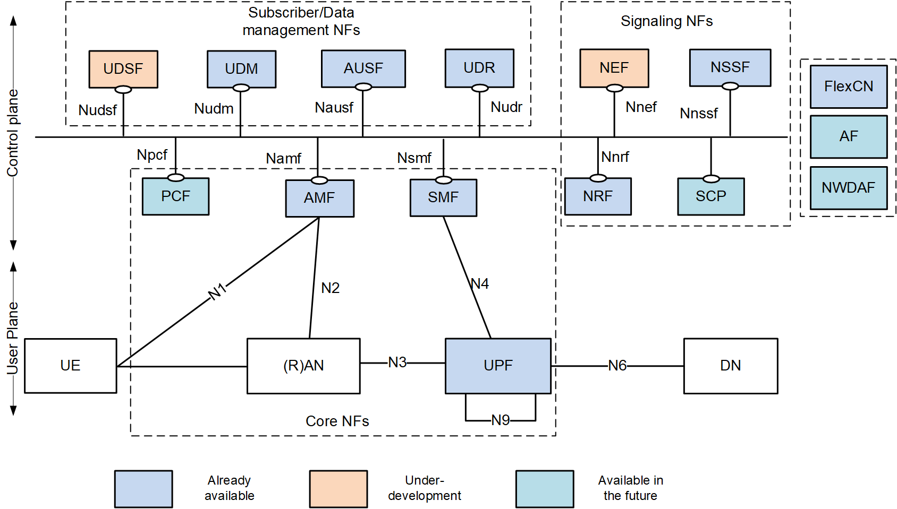

<!-- SPDX-License-Identifier: CC-BY-4.0 -->

<table style="border-collapse: collapse; border: none;">
  <tr style="border-collapse: collapse; border: none;">
    <td style="border-collapse: collapse; border: none;">
      <a href="http://www.openairinterface.org/">
         
         </img>
      </a>
    </td>
    <td style="border-collapse: collapse; border: none; vertical-align: center;">
      <b>OpenAirInterface NEF Feature Set</b>
    </td>
  </tr>
</table>

This page is a coverage checklist: which 3GPP NEF capabilities OAI NEF implements, which it does
not, and how completely. It is intentionally coarse. For the endpoints, payloads and status codes
of anything marked implemented, follow the links in section 4 into the
[API reference](api-reference/overview.md); for how a request is actually served, see
[ARCHITECTURE.md](ARCHITECTURE.md).

Most rows below say "partially implemented", and the comment column is where the useful detail
lives — it says which part.

**Table of Contents**

1. [5GC Service Based Architecture](#1-5gc-service-based-architecture)
2. [OAI NEF Available Interfaces](#2-oai-nef-available-interfaces)
3. [OAI NEF Feature List](#3-oai-nef-feature-list)
4. [Implemented Service APIs](#4-implemented-service-apis)

# 1. 5GC Service Based Architecture #

Where NEF sits among the other network functions, for context.

# 2. OAI NEF Available Interfaces #

NEF has two interfaces: one towards the rest of the core, one towards the outside world.

| **ID** | **Interface** | **Status**         | **Comment**                                                        |
| ------ | ------------- | ------------------ | ------------------------------------------------------------------ |
| 1      | SBI           | :heavy_check_mark: | between NEF and other NFs (NRF, AMF, SMF, PCF, UDR). No UDM, no NWDAF. |
| 2      | N33 / T8      | :heavy_check_mark: | northbound RESTful APIs towards the AF/SCS-AS (`/3gpp-*` paths, TS 29.122 / TS 29.522) |

All interfaces are served over HTTP/2 cleartext (h2c); there is no TLS at the application layer.
See the [API reference](api-reference/overview.md) for the full endpoint list.

# 3. OAI NEF Feature List #

TS 23.501 lists eight NEF capability classifications. Five are partially implemented here and
three are not implemented at all. The comment column says what "partially" means in each case.

Based on document **3GPP TS 23.501 v16.0.0 (Section 6.2.5)**.

| **ID** | **Classification**                                                        | **Status**         | **Comments**                             |
| ------ | ------------------------------------------------------------------------- | ------------------ | ---------------------------------------- |
| 1      | Exposure of capabilities and events                                       | :heavy_check_mark: | Partially implemented. Monitoring Event (TS 29.122 §5.6) is backed by AMF event exposure. Inbound AMF and SMF notifications arrive on `/nef-notify/v1/notify` and are relayed to the AF as T8 monitoring-event and user-plane-event notifications. |
| 2      | Secure provision of information from external application to 3GPP network | :heavy_check_mark: | Partially implemented. PFD provisioning to the UDR, traffic-influence provisioning to PCF and UDR, BDT policy negotiation and AsSessionWithQoS towards the PCF. Requests are authorized by AF whitelist and/or JWT bearer token. |
| 3      | Translation of internal-external information                              | :heavy_check_mark: | Partially implemented. `nef_notification_mapper` translates AMF EventExposure notifications (TS 29.518) and SMF event notifications (TS 29.508) into T8 notification formats (TS 29.122). There is no AF-Service-Identifier to DNN/S-NSSAI translation, and no masking of SUPI/GPSI towards the AF. |
| 4      | Exposure of analytics                                                     | :heavy_check_mark: | Partially implemented. The AnalyticsExposure API (`/3gpp-analyticsexposure/v1`) is routed and served — subscription CRUD and the `/fetch` operation. It is answered **entirely from NEF-local state**: there is no NWDAF client, so no analytics are retrieved from the network and no analytics notifications are delivered. |
| 5      | Retrieval of data from external party by NWDAF                            | :heavy_check_mark: | Partially implemented. Nnef_EventExposure (TS 29.591) subscription CRUD is served on the SBI. |
| 6      | Support of Non-IP Data Delivery                                           | :x:                |                                          |
| 7      | Support of UAS NF functionality                                           | :x:                |                                          |
| 8      | Support of EAS deployment functionality                                   | :x:                |                                          |

# 4. Implemented Service APIs #

Ten routes are served: eight 3GPP service APIs plus a notification sink and a health endpoint.
Each row links to its reference page.

| Service | Base path | Spec | Reference |
| ------- | --------- | ---- | --------- |
| Monitoring Event | `/3gpp-monitoring-event/v1` | TS 29.122 §5.6 | [monitoring-event.md](api-reference/monitoring-event.md) |
| Traffic Influence | `/3gpp-traffic-influence/v1` | TS 29.522 | [traffic-influence.md](api-reference/traffic-influence.md) |
| PFD Management (T8) | `/3gpp-pfd-management/v1` | TS 29.122 | [pfd-management.md](api-reference/pfd-management.md) |
| BDT Policy | `/3gpp-bdt/v1` | TS 29.122 §5.13 | [bdt-policy.md](api-reference/bdt-policy.md) |
| AsSessionWithQoS | `/3gpp-as-session-with-qos/v1` | TS 29.122 §5.7 | [qos-monitoring.md](api-reference/qos-monitoring.md) |
| Analytics Exposure | `/3gpp-analyticsexposure/v1` | TS 29.522 / TS 29.520 | [analytics-exposure.md](api-reference/analytics-exposure.md) |
| Nnef_EventExposure | `/nnef-eventexposure/v1` | TS 29.591 | [nnef-event-exposure.md](api-reference/nnef-event-exposure.md) |
| Nnef_PFDmanagement | `/nnef-pfdmanagement/v1` | TS 29.551 | [nnef-pfd-management.md](api-reference/nnef-pfd-management.md) |
| Notification sink | `/nef-notify/v1/notify` | — | [operational-endpoints.md](api-reference/operational-endpoints.md) |
| Health | `/health` | — | [operational-endpoints.md](api-reference/operational-endpoints.md) |

Two limitations apply across all of the above, and neither is configurable. All NEF state is held
in memory: there is no persistence layer, so a restart loses every subscription, transaction and
policy. And there is no CAPIF support.
