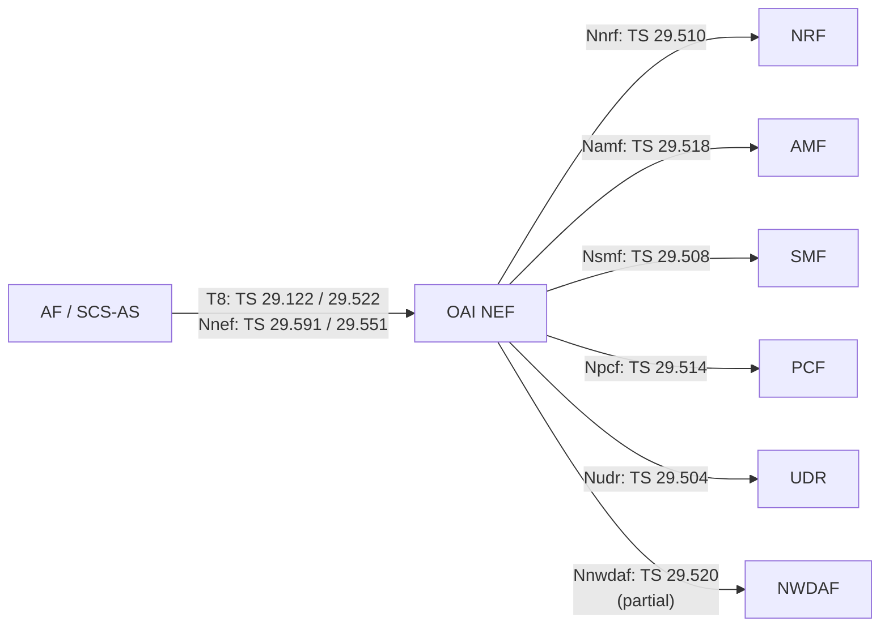
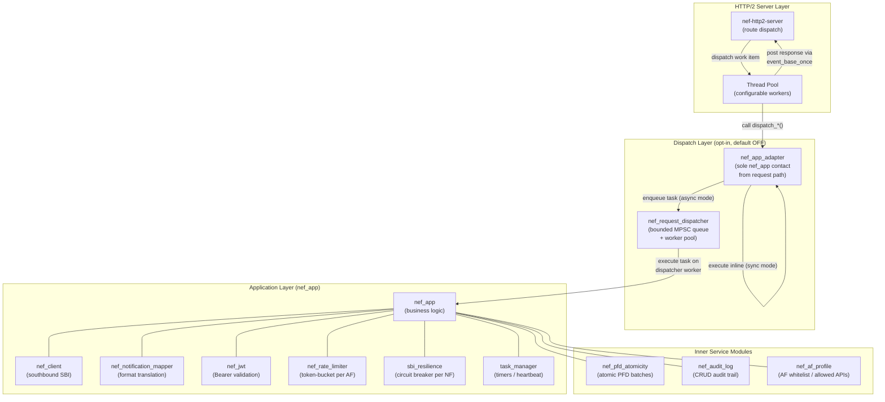
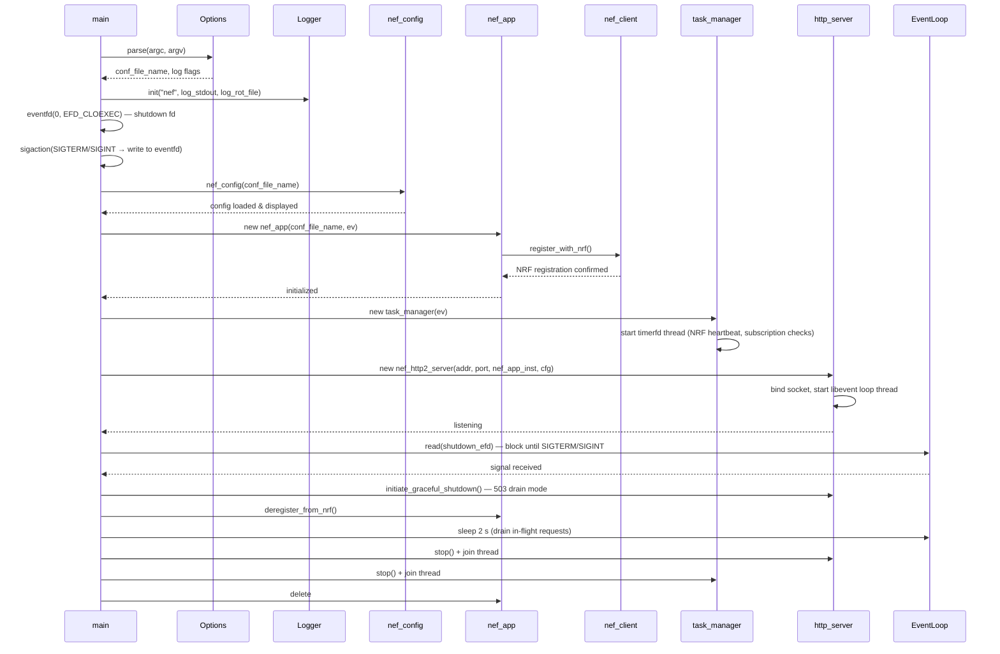

# OAI NEF Architecture

## 1. NEF in 5G Core Network Topology

The Network Exposure Function (NEF) is defined in 3GPP TS 23.501 §6.2.5 as the single point of entry through which external applications interact with the 5G Core Network. Rather than allowing Application Functions (AFs) or SCS/AS entities to contact internal NFs directly, the NEF intermediates every request, enforces authorization and rate limits, translates between external and internal data models, and routes the request to the appropriate core NF.

On the northbound side NEF exposes two interface families. The **T8 interface** (TS 29.122, TS 29.522, TS 29.551) is the traditional T8 REST API used by external SCS/AS entities for monitoring event subscriptions, traffic influence, PFD management, QoS monitoring, and BDT policy. The **Nnef SBI interface** (TS 29.591, TS 29.551) is the 5G Service Based Interface used by internal NFs or CAPIF-authorized parties for Nnef_EventExposure and Nnef_PFDmanagement interactions.

On the southbound side NEF communicates with the NRF (for NF registration and discovery), AMF (to subscribe to UE-related events), SMF (for traffic steering and PFD delivery), PCF (for policy provisioning), and UDR (for persistent data access). A partial interface toward NWDAF is present for analytics exposure. All southbound calls use HTTP/2-based SBI, protected by the circuit-breaker and retry logic described in §6 and §10 of this document.



## 2. Internal Module Architecture

### Component Diagram



> **Dispatch layer** is always active. NEF HTTP handlers route through `nef_app_adapter`, which enqueues work on the bounded dispatcher pool. Some handlers still use Option A synchronous handoff via `std::future`; southbound-heavy handlers use Option B non-blocking deferred responses via `http2_deferred_response`. The removed `use_async_dispatch: false` and `NEF_DISABLE_ASYNC_DISPATCH` synchronous modes no longer exist.

### Module Reference

| Module | Primary Files | Responsibility |
|--------|---------------|----------------|
| `nef-http2-server` | `api-server/nef-http2-server.h/cpp` | Registers all NEF routes; routes requests through `nef_app_adapter` (zero direct `nef_app` calls in handler bodies) |
| `http2-server` | `api-server/http2-server.h/cpp` | Generic HTTP/2 server built on nghttp2 v1.68.1 + libevent; manages connections, stream state, flow control, CVE mitigations, and `http2_deferred_response` for non-blocking handlers |
| `thread-pool` | `api-server/thread-pool.h` | Configurable worker thread pool; accepts work items from the libevent event loop and posts responses back via `event_base_once` |
| `nef_app_adapter` | `nef_app/nef_app_adapter.hpp/cpp` | **Dispatch facade.** The sole class with direct `nef_app` access from the request path. Provides one typed `dispatch_*()` method per HTTP handler. Manages bearer-token re-set/clear (`execute_with_token`) with an RAII guard and owns a `nef_request_dispatcher` instance. |
| `nef_request_dispatcher` | `nef_app/nef_request_dispatcher.hpp` | Bounded MPSC task queue with a configurable worker pool. Executes `std::function<void()>` tasks enqueued by `nef_app_adapter`. Returns `queue_full` (→ 503) when the configured capacity is exceeded. Header-only. |
| `nef_request_task` | `nef_app/nef_request_task.hpp` | Type alias: `response_sink = std::function<void(int status_code, std::string body)>`. The value-captured response callback that crosses the thread boundary safely. Header-only. |
| `nef_app` | `nef_app/nef_app.hpp/cpp` | Central controller; executes all subscription CRUD, AF authorization, notification routing, and inter-NF coordination |
| `nef_client` | `nef_app/nef_client.hpp/cpp` | HTTP/SBI client for NRF registration/discovery and all southbound calls (AMF, SMF, PCF, UDR). Provides both blocking (`send_http_request`) and non-blocking (`send_http_request_async`) overloads for southbound calls |
| `nef_notification_mapper` | `nef_app/nef_notification_mapper.hpp/cpp` | Stateless utility; converts southbound NF notifications from internal SBI format into northbound T8 format for AFs |
| `nef_jwt` | `nef_app/nef_jwt.hpp/cpp` | Parses and validates JWT Bearer tokens using HMAC-SHA256; extracts the `sub` claim as the AF identity |
| `nef_rate_limiter` | `nef_app/nef_rate_limiter.hpp` | Token-bucket rate limiter keyed on AF/bearer identity; rejects requests that exceed the configured burst and refill rate |
| `sbi_resilience` | `nef_app/sbi_resilience.hpp` | Circuit-breaker (CLOSED → OPEN → HALF_OPEN) with independent state per NF type (AMF, SMF, PCF, UDR each isolated) |
| `nef_retry_helper` | `nef_app/nef_retry_helper.hpp` | Exponential backoff retry logic wrapping `nef_client` calls |
| `task_manager` | `nef_app/task_manager.hpp/cpp` | Periodic background tasks using `timerfd`: NRF heartbeat and subscription validity checks |
| `nef_af_profile` | `nef_app/nef_af_profile.hpp/cpp` | Tracks registered AFs; enforces per-AF whitelist entries, optional API key validation, and allowed API set restrictions |
| `nef_input_validation` | `nef_app/nef_input_validation.hpp` | Validates JSON request bodies: required vs optional fields, string lengths, and enum values |
| `nef_pfd_atomicity` | `nef_app/nef_pfd_atomicity.hpp` | Ensures PFD batch operations are atomic with rollback on partial failure |
| `nef_audit_log` | `nef_app/nef_audit_log.hpp` | Structured audit trail for all subscription create/update/delete operations |
| `nef_event` | `nef_app/nef_event.hpp/cpp` | Pub-sub mediator using Boost.Signals2; signals: `task_tick`, `nf_notification`, `subscription_expired` |
| `nef_config` | `nef_app/nef_config.hpp` | Extends the base config framework; initializes NRF, AMF, SMF, PCF, UDR endpoint descriptors from YAML |
| `nef.h` | `common/nef.h` | Core enum definitions: `nef_service_type_t`, `nef_monitoring_event_type_t`, `nf_type_t`, and service name macros |

## 3. Source Code Layout

```
src/
├── oai-nef/        — Application entry point
│   ├── main.cpp    — Initializes config, logger, event system, HTTP server,
│   │                 task manager, and signal handler (eventfd-based)
│   └── options.cpp — CLI option parsing: --config, --log-stdout, --log-rot-file
│
├── nef_app/        — Core business logic (all NEF services, auth, resilience)
│
├── api-server/     — HTTP/2 server (nghttp2 + libevent)
│   ├── http2-server.h/cpp      — Generic HTTP/2 connection management
│   ├── nef-http2-server.h/cpp  — NEF route registration and dispatch
│   └── thread-pool.h           — Async worker thread pool
│
├── common/         — Shared type definitions
│   └── nef.h       — Core enumerations and service name constants
│
└── common-src/     — Shared infrastructure (git submodule)
    ├── config/     — Base YAML configuration framework
    └── logger/     — Logging infrastructure (spdlog / LTTNG)
```

## 4. Request Processing Pipeline

The following steps describe how a single northbound AF request is handled from the moment the TCP connection delivers data until the HTTP/2 response is written back.

1. **HTTP/2 connection accepted by libevent** — `libevent` monitors the listening socket with `evconnlistener`. When a new connection arrives a bufferevent is created and handed to the HTTP/2 server layer.
2. **nghttp2 parses HTTP/2 frames** — The generic `http2-server` feeds received bytes to the nghttp2 session. nghttp2 reassembles HEADERS and DATA frames and fires the configured `on_request_recv` callback once a complete request stream is ready.
3. **Thread pool worker picks up the request** — The `on_request_recv` callback submits a work item to the `thread_pool`. The event loop thread immediately returns to processing I/O, avoiding blocking.
4. **nef-http2-server routes to matching handler** — The worker thread invokes the `nef_http2_server` dispatch logic, which performs longest-prefix matching on the request path to select the correct handler shim. The handler shim performs JSON body parsing (returning HTTP 400 on parse error) and then delegates all `nef_app` interaction to `nef_app_adapter` — there are zero direct `nef_app` calls in handler bodies.
5. **nef_rate_limiter checks rate** — Before the handler body executes, `nef_rate_limiter` checks the token bucket for the requesting AF identity. If the bucket is exhausted the request is rejected immediately with HTTP 429.
6. **nef_jwt validates Bearer token** — When a `jwt_secret` is configured, `nef_jwt` parses the `Authorization: Bearer` header, verifies the HMAC-SHA256 signature, checks expiry, and extracts the `sub` claim as the AF identity.
7. **nef_af_profile validates whitelist and allowed APIs** — The resolved AF identity is looked up in `nef_af_profile`. If an `af_whitelist` is configured, the AF must appear in it with a matching optional `api_key`. The requested service must also be present in the AF's `allowed_apis` set (if non-empty).
8. **nef_input_validation validates request body** — The parsed JSON body is checked for required fields, data types, string length limits, and enum values. Invalid requests are rejected with HTTP 400 before any state is mutated.
9. **nef_app_adapter dispatches to nef_app** — The handler calls `m_adapter->dispatch_<op>(params, bearer_token, response_sink)`. The adapter enqueues the task on the `nef_request_dispatcher` pool, re-sets the bearer token on the execution thread (`execute_with_token`) with RAII cleanup, and calls `nef_app`. The HTTP worker either blocks on a `std::future` for existing Option A handlers or returns immediately with a `http2_deferred_response` handle for Option B southbound-heavy handlers. A full queue returns HTTP 503.
10. **nef_app handler executes business logic** — The appropriate handler method (e.g., `handle_monitoring_event_subscription_create`) updates in-memory subscription state, routes events via `nef_event` Boost.Signals2 signals, and records an audit entry via `nef_audit_log`.
11. **nef_client makes southbound call (with sbi_resilience circuit breaker)** — If the operation requires a call to AMF, SMF, PCF, or UDR, `nef_client` sends the SBI request. For legacy handler bodies `send_http_request()` blocks the dispatcher worker; in Option B `send_http_request_async()` submits to the Boost.Asio I/O service in `http_client_impl` and returns immediately — the completion callback delivers the response through `http2_deferred_response::send()`. `sbi_resilience` wraps calls: if a circuit is OPEN the call is rejected immediately and `nef_retry_helper` schedules backoff; a HALF_OPEN probe tests recovery.
12. **Response posted back to event loop** — The execution thread (HTTP pool worker in sync mode, dispatcher worker in async mode, or Asio I/O thread in Option B) posts the HTTP response back to the libevent event loop via `event_base_once`, which is the only thread-safe libevent API for cross-thread wakeup.
13. **HTTP/2 response sent to AF** — The event loop thread serializes the response into HTTP/2 HEADERS and DATA frames via nghttp2 and writes them to the bufferevent. The stream is half-closed from the server side and the connection remains open for subsequent requests.

## 5. Startup Sequence



## 6. Threading Model

OAI NEF uses a **multi-tier threading model** with a dedicated dispatcher tier for NEF request execution.

- **Single event loop thread** — `libevent` runs in a dedicated thread started by `nef_http2_server::start`. All socket I/O, timer callbacks, and nghttp2 session state are handled exclusively on this thread. Because libevent's non-thread-safe APIs (`event_base_*`) are only called here, no mutex is required for the event loop itself.

- **HTTP thread pool workers** — A configurable number of worker threads (defaulting to `std::thread::hardware_concurrency()`, minimum 1) pick up request work items from a thread-safe queue. Workers execute routing, auth, input validation, and dispatch to `nef_app_adapter`. Workers hand off to the dispatcher pool after building the task; they do not call `nef_app` directly from NEF handler bodies.

- **Dispatcher worker pool (always enabled)** — A dedicated `nef_request_dispatcher` pool (sized slightly larger than the HTTP pool by default) owns the execution of `nef_app` handler methods. This decouples the HTTP accept bandwidth from the southbound call latency. Workers re-set the bearer token on their own `thread_local` before calling `nef_app` (`execute_with_token` in `nef_app_adapter`) — cross-thread token propagation is never relied upon. Under **Option A** (synchronous handoff), the HTTP worker parks on a `std::future` until the dispatcher worker completes; under **Option B** (non-blocking, southbound-heavy handlers), the HTTP worker returns immediately after posting an `http2_deferred_response` handle, and the response is delivered from a `http_client` Asio I/O thread.

- **http_client Asio I/O threads (4–16, internal to `http_client_impl`)** — An existing Boost.Asio `io_service` in the shared `http_client` library drives all outbound HTTP/2 streams asynchronously. Under Option B these threads deliver completed southbound responses and call `http2_deferred_response::send()` to post the inbound response back to the libevent event loop via `event_base_once`. These threads are infrastructure shared with NRF registration and heartbeat; they run independently of the dispatcher setting.

- **Cross-thread response posting** — All paths (dispatcher worker, Asio I/O thread) post the final response to the libevent event loop via `event_base_once`. This is the sole thread-safe libevent entry point.

- **Task manager thread** — A dedicated thread runs `task_manager` using Linux `timerfd` for periodic work (NRF heartbeat, subscription expiry checks). It communicates with `nef_app` via Boost.Signals2 `task_tick` signals dispatched synchronously on the calling thread.

| Mode | HTTP worker does | Dispatcher worker does | Asio I/O thread does |
|------|-----------------|----------------------|----------------------|
| Sync (default) | routing + auth + nef_app call + response | — | southbound I/O (all paths) |
| Async Option A | routing + auth + enqueue + `fut.wait()` | nef_app call + response | southbound I/O |
| Async Option B | routing + auth + enqueue + return | nef_app call + `send_http_request_async()` | deliver response via `deferred.send()` |

The net result: only the event loop thread performs HTTP/2 I/O; CPU-bound work and blocking southbound calls are isolated from the I/O path in all modes.

## 7. In-Memory State (No Persistence)

**All NEF subscription state is held entirely in memory.** No database, file, or external store is used. This has the following operational consequences:

- **A NEF restart clears all subscriptions.** Any monitoring event subscription, traffic influence policy, PFD transaction, QoS subscription, BDT policy, or Nnef_EventExposure subscription that was active before the restart is gone after the process comes back up.
- **AFs must re-subscribe after a NEF restart.** Applications that rely on active subscriptions must detect NEF unavailability (e.g., via a failed notification delivery or health check) and re-issue their subscription creation requests.
- **NRF deregistration on shutdown** (see §5) removes the NEF service profile so that during the restart window the NRF does not route new traffic to the unavailable instance; however, the NRF cannot notify existing AFs of the event.
- **No subscription state is replicated across multiple NEF instances.** Running more than one NEF instance behind a load balancer will result in split subscription state; a notification from an NF will only reach the NEF instance that holds the corresponding subscription. High-availability topologies are therefore not supported in this release.
