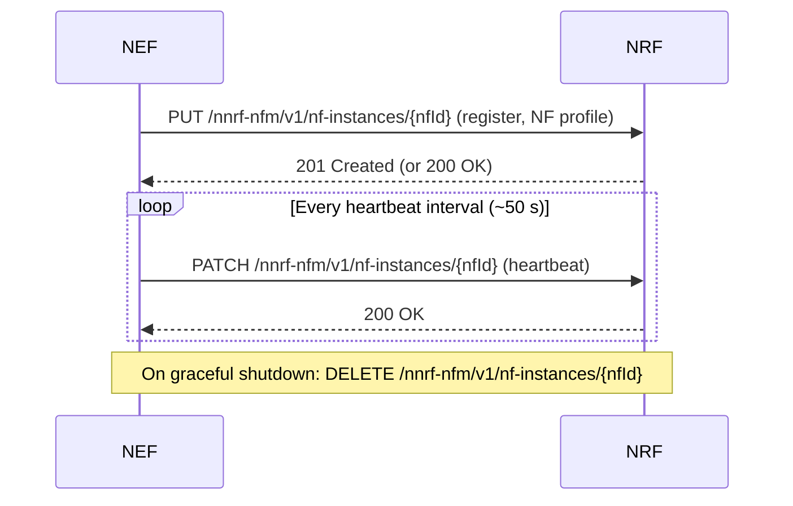
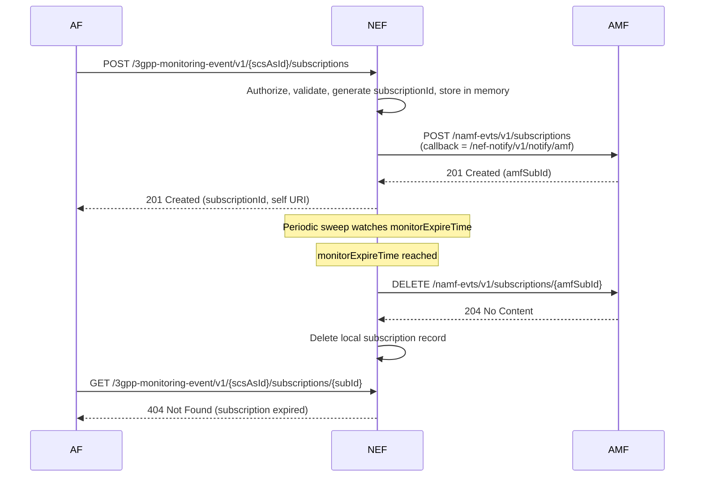
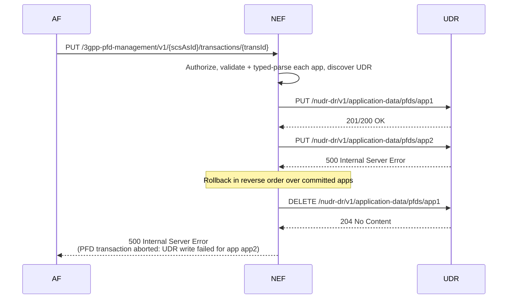
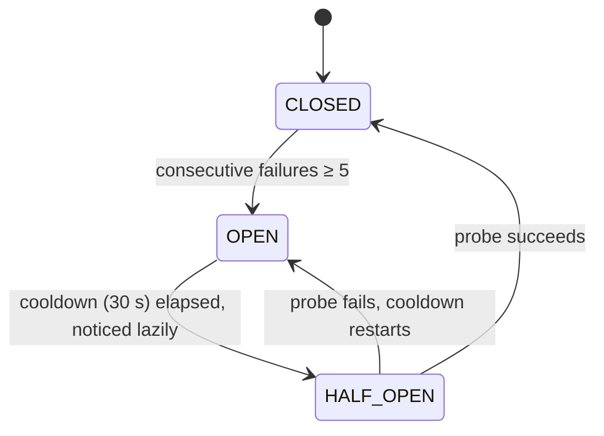
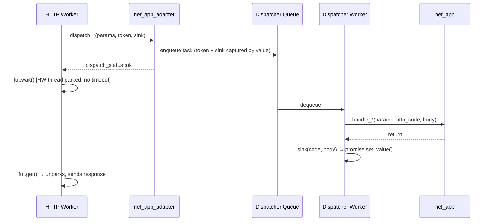
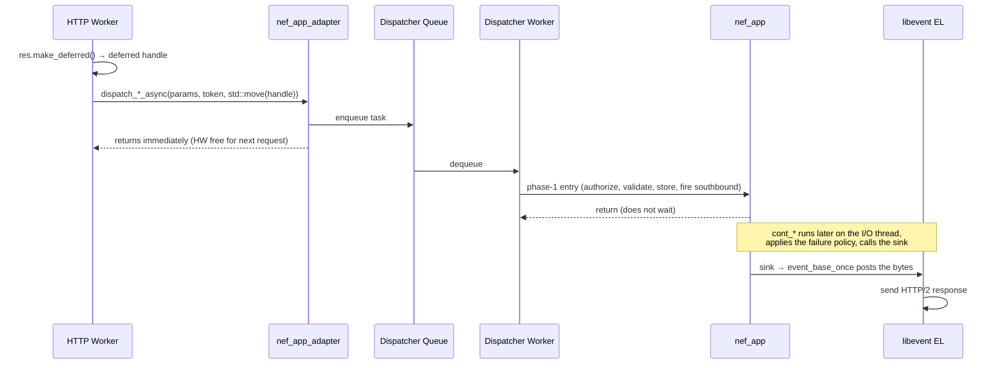
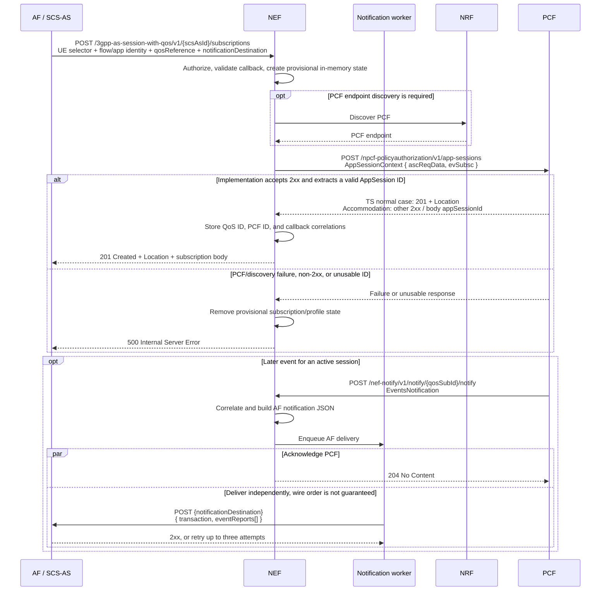
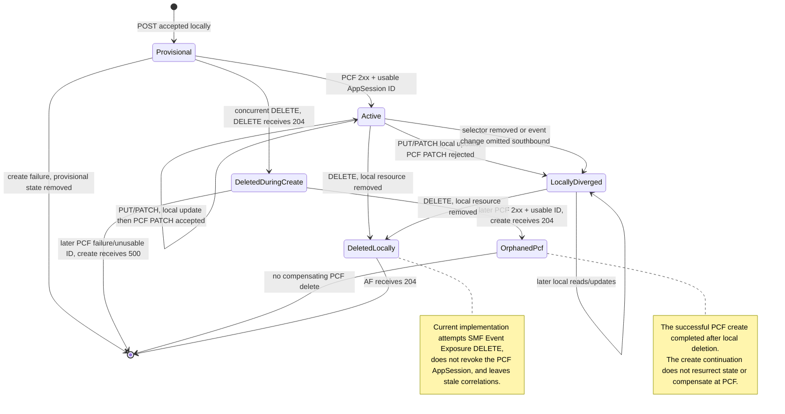

# Call Flows

This document traces the interactions between OAI NEF and the entities around it
— AFs, NRF, AMF, SMF, PCF, and UDR — for the main operations. Each section
follows one flow from request to response, including the error and expiry paths
where they matter.

Every sequence here reflects the code, not the spec-ideal design. Where the
implementation diverges from what an AF might expect, the flow says so.

For the request path itself — threads, blocking vs. deferred dispatch, and the
`cont_*` continuation model — see [`ARCHITECTURE.md`](ARCHITECTURE.md) §2, §4,
and §5. This page does not restate it.

---

## 1. NRF Registration and Heartbeat

At startup NEF registers its NF profile with NRF. `nef_client` inherits
`oai::sba::nf_service` and delegates registration, de-registration, and
discovery to it. Registration is a `PUT` to the NF management endpoint; the
profile carries the NF type (`NEF`), address, SBI port, and the services NEF
offers. After registering, a periodic task issues a heartbeat `PATCH`. On
graceful shutdown NEF de-registers with a `DELETE`.



**Key points**:

- Registration and discovery go through the southbound circuit breaker (keyed
  `"NRF"`) with retry and exponential backoff. If the initial `PUT` fails, NEF
  retries.
- A heartbeat that fails is logged (`NRF heartbeat failed ... — will
  re-register`) and triggers a re-registration.
- `/health` does **not** reflect NRF registration state — it returns `200` with
  `status: "ok"` once the server is up, regardless of NRF. Check registration
  from the logs. See [Troubleshooting](troubleshooting.md#nrf-registration-failure).
- On an abnormal exit (SIGKILL, crash) the `DELETE` is not sent; NRF expires the
  registration by its own TTL.

---

## 2. Monitoring Event Subscription (with Expiry)

When an AF creates a monitoring event subscription, NEF validates and authorizes
the request, stores it in memory, and fires a `Namf_EventExposure_Subscribe`
southbound to AMF. On the AMF response it records the AMF subscription ID and
answers the AF `201`.



**Key points**:

- **The AMF callback is a single fixed path**, `/nef-notify/v1/notify/amf`, not
  a per-subscription URI. NEF stores the mapping from the AMF-assigned
  subscription ID to the AF subscription ID at create time.
- **Inbound monitoring notifications are not forwarded to the AF in this
  release.** The inbound route `/nef-notify/v1/notify/{nf-sub-id}` correlates a
  notification to an AF subscription by the trailing path segment. Because the
  advertised AMF callback ends in the literal `amf`, an AMF notification arrives
  with `nf-sub-id = "amf"`, which never matches the stored AMF subscription ID.
  The handler logs `No AF subscription found for NF sub-id: amf` and answers
  `404`. The subscribe and expiry flows above work; the AMF→NEF→AF report
  delivery does not correlate. Do not rely on it.
- The southbound calls here (`subscribe`/`unsubscribe`) run on the async request
  path and do not consult the southbound circuit breaker.
- If NEF restarts, the in-memory record is lost. See
  [Resilience — In-Memory State](resilience.md#in-memory-state-and-restart-behaviour).

---

## 3. Traffic Influence

The Traffic Influence API steers traffic for UEs or application flows. A create
is a **two-leg southbound chain**: a PCF `Npcf_PolicyAuthorization` app-session,
then a UDR influence-data write. The PCF leg is fatal on failure; the UDR leg is
best-effort.

```mermaid
sequenceDiagram
    participant AF
    participant NEF
    participant PCF
    participant UDR
    AF->>NEF: POST /3gpp-traffic-influence/v1/{afId}/subscriptions
    NEF->>NEF: Authorize, validate, discover PCF + UDR, store provisional state
    NEF->>PCF: POST /npcf-policyauthorization/v1/app-sessions
    alt PCF create succeeds (2xx + usable appSessionId)
        PCF-->>NEF: 201 Created (appSessionId)
        NEF->>UDR: PUT /nudr-dr/v2/application-data/influenceData/{tiId}
        UDR-->>NEF: 200/201 (best-effort; failure is logged only)
        NEF-->>AF: 201 Created (subscriptionId)
    else PCF create fails
        PCF-->>NEF: non-2xx / no usable ID
        NEF->>NEF: Roll back provisional local state
        NEF-->>AF: 502 Bad Gateway
    end
    AF->>NEF: PATCH .../subscriptions/{subId}
    NEF->>PCF: PATCH /npcf-policyauthorization/v1/app-sessions/{appSessionId}<br/>(merge-patch+json)
    PCF-->>NEF: 200 OK
    NEF-->>AF: 200 OK
    AF->>NEF: DELETE .../subscriptions/{subId}
    NEF->>PCF: POST /npcf-policyauthorization/v1/app-sessions/{appSessionId}/delete
    NEF->>UDR: DELETE /nudr-dr/v2/application-data/influenceData/{tiId}
    NEF-->>AF: 204 No Content
```

**Key points**:

- **PCF deletion is a POST, not a DELETE.** PCF spells app-session deletion as
  `POST .../app-sessions/{id}/delete`.
- The create chains PCF then UDR. A PCF failure fails the request with `502` and
  rolls back local state; a UDR influence-data failure is logged only, and the
  AF still gets `201`.
- Influence data uses the UDR `v2` path (`.../application-data/influenceData/`).
- NEF keeps the `subscriptionId` → PCF `appSessionId` mapping in memory.
- These southbound calls run on the async request path and do not consult the
  southbound circuit breaker.

---

## 4. PFD Management Atomic Batch (with Rollback)

A PFD transaction `PUT` is best-effort atomic: NEF writes each application's PFD
data to UDR in turn, and commits local state only after every write succeeds. If
a write fails mid-batch, NEF issues compensating `DELETE`s over the
already-written applications **in reverse order**, then aborts the transaction.



**Key points**:

- **A failed UDR write aborts the transaction with `500`**, not `400`. The
  detail names the failing application.
- Local state is committed only after all UDR writes succeed, so on a failure
  there is no partial local commit; the rollback is southbound-only and
  best-effort. If a rollback `DELETE` also fails, NEF logs the inconsistency and
  still returns `500` — UDR may retain an orphaned entry.
- PFD data `PUT` and `DELETE` use the UDR `v1` path; the PFD `GET` uses `v2`.
- A successful transaction returns `201 Created` on first creation, or `200 OK`
  when it replaces an existing transaction, with the stored PFD objects.
- The live path uses the `pfd_put_rollback` / `pfd_rollback_step` continuations
  (see [`ARCHITECTURE.md`](ARCHITECTURE.md) §6); the `PfdRollbackTracker` in
  `nef_pfd_atomicity.hpp` models the same reverse-order compensation but is not
  on the live path.

---

## 5. Southbound Circuit Breaker

The southbound circuit breaker (`sbi_circuit_breaker_registry`) is a
process-wide singleton keyed by **NF type** — `"NRF"`, `"AMF"`, `"SMF"`,
`"PCF"`, `"UDR"`. It is not keyed by NF instance ID. It guards only the calls
made through `sbi_call_with_retry`: NRF registration, NRF discovery, and
`nef_client`'s blocking SBI methods. The async request-path calls used by the
live handlers (sections 2–4, 7) bypass it.



**Key points**:

- A 2xx clears the breaker. A 4xx is a permanent application error and does not
  count. Only status 0 (connection failure) and 5xx failures that survive the
  retry budget increment the counter.
- When the breaker is OPEN, `sbi_call_with_retry` returns `-1` and sends
  nothing. The breaker does not itself emit an HTTP status. On the request path
  this most often surfaces as a discovery failure, which the handler maps to its
  own failure policy (for example `500` for a QoS create, `502` for a TI PCF
  create) — not a uniform `503`.
- The `OPEN → HALF-OPEN` move is lazy: it happens on the next `is_open()` call
  after the cooldown, not on a timer, and lets exactly one probe through.
- See [Resilience — Southbound Circuit Breaker](resilience.md#southbound-circuit-breaker)
  for the full mechanism, and the northbound AF-notification breaker, which
  behaves differently.

---

## 6. Async vs. Blocking Dispatch

Every route is dispatched through the `nef_app_adapter` and the
`nef_request_dispatcher` worker pool. Fifty endpoints split into two shapes:
**24 are asynchronous (deferred) and 26 are synchronous (blocking)** under the
same facade. The authoritative per-endpoint split is in
[`ARCHITECTURE.md`](ARCHITECTURE.md) §4.1; the rule is simple: **an endpoint is
async exactly when it has a southbound leg.** Reads served from NEF's own maps
stay synchronous.

The two shapes differ only in how the response is delivered.

### 6.1 Blocking (26 endpoints)

The HTTP worker enqueues the task and parks on a `std::future` until the
dispatcher worker resolves it. Suitable where the handler's latency is bounded
(in-memory reads, non-southbound writes).



### 6.2 Deferred (24 endpoints)

The HTTP worker returns immediately after enqueue. The dispatcher worker fires
the southbound call; a `cont_*` continuation later delivers the response by
posting back onto the libevent loop.



**Key properties** (full detail in [`ARCHITECTURE.md`](ARCHITECTURE.md) §8):

- The blocking sink must be called exactly once; a second call throws, and never
  calling it parks the HTTP worker forever (no timeout).
- The deferred sink is exactly-once via an atomic CAS; a second call is a silent
  no-op. If the deferred handle is dropped without a `send()`, its destructor
  posts `500 Internal Server Error` so the client does not hang.
- A rejected dispatch (queue full or shutting down) returns `503` — `"Server is
  overloaded, please retry later"`.
- The bearer token is captured by value into the task and re-set on the
  dispatcher thread before the handler runs. See
  [Security — Bearer Token Cross-Thread Safety](security.md#bearer-token-cross-thread-safety).

The legacy inline adapter mode was removed; a config that still sets the old
`use_async_dispatch` key starts normally and uses the dispatcher path anyway.

---

## 7. AS Session with QoS and QoS Monitoring (TS 29.122)

The AS Session with QoS API maps a northbound TS 29.122 subscription from an AF
/ SCS-AS to a southbound TS 29.514 PCF AppSession. QoS monitoring is an optional
event capability within that subscription, not a separate resource family. PCF
endpoint discovery is conditional: NEF first uses a configured or cached
endpoint. The notification worker decouples the later PCF acknowledgement from
delivery to the AF callback.

### 7.1 Create and asynchronous monitoring sequence



**Key points**:

- Request processing proceeds through drain and rate-limit checks, JSON parsing,
  deferred dispatcher submission, authorization using the literal service
  identifier `nnef-qosmonitoring`, typed and semantic validation, callback SSRF
  validation, provisional in-memory subscription/profile storage, PCF
  translation, conditional endpoint discovery, and an asynchronous PCF `POST`.
- A recommended request supplies `{scsAsId}`, one supported UE address selector
  (`ueIpv4Addr`, `ueIpv6Addr`, or `macAddr`), a flow/application identity,
  `qosReference`, and `notificationDestination`. This follows the TS 29.122
  clause 4.4.13 procedure and downstream PCF needs, not merely the looser
  OpenAPI `required` array.
- NEF translates `flowInfo` into PCF media components and copies `qosReference`;
  PCF policy configuration interprets the reference. `events` becomes
  `evSubsc.events`, with successful and failed resource-allocation events always
  requested. The presence of `qosMonInfo` without explicit `events` still adds
  `QOS_MONITORING`.
- **Current implementation limitation — generated-model collision:** the
  compiled `QosMonitoringInformation` type preserves only `repThreshDl`,
  `repThreshUl`, and `repThreshRp`. It discards the TS 29.122 `reqQosMonParams`,
  `repFreqs`, `repPeriod`, and `waitTime` members. A recommended request
  containing only those discarded members therefore produces `qosMonInfo: null`
  in the typed `201` response and `evSubsc.qosMon: null` toward PCF; NEF does
  not populate `evSubsc.reqQosMonParams` from the discarded array. Supplying
  threshold members preserves only those thresholds. This is the shipped
  translation behavior, not the TS-defined `qosMonInfo` shape.
- **TS-defined behavior:** TS 29.514 defines `201 Created` with a required
  `Location`, and separately `303 See Other` with `Location` when the request
  would be equivalent to an existing resource. **Implemented behavior:** NEF
  accepts any `2xx` response when it can obtain a safe AppSession ID from the
  non-schema body property `appSessionId` or the final `Location` segment. It
  rejects `303`, rolls back provisional state, and returns `500`.
- **Current implementation limitation:** the northbound create adapter forms
  `self` and `Location` by concatenating the raw server bind address with the
  relative resource path. The resulting value lacks a scheme and port and is not
  an absolute URI.
- `notificationDestination` belongs to the AF / SCS-AS and is the target for the
  northbound notification. The distinct NEF callback in PCF `evSubsc.notifUri`
  is built from `/nef-notify/v1/notify/{qosSubId}`; PCF appends `/notify`. NEF
  builds `UserPlaneNotificationData`-shaped JSON, splits `QOS_NOTIF` into
  `QOS_GUARANTEED` or `QOS_NOT_GUARANTEED`, and propagates available monitoring,
  usage, QoS-reference, and PLMN details. If mapping fails, NEF forwards the raw
  PCF payload.
- **Current implementation limitation — flow identifier shape:** TS 29.514
  represents `AfEventNotification.flows` as objects such as `{ "medCompN": 1 }`,
  whereas TS 29.122 requires integer `flowIds` such as `[1]`. The mapper copies
  the PCF `flows` array verbatim instead of extracting `medCompN`, so conformant
  PCF input is emitted as nonconformant `"flowIds": [{ "medCompN": 1 }]`. When
  PCF omits `flows`, NEF omits `flowIds` and the report applies to all flows.
- The create path stores the relative subscription path in memory before the
  adapter rewrites only the serialized `201` response's `self` and `Location`.
  The mapper later copies the stored value verbatim, so the implemented AF
  notification normally has a relative `transaction`, such as
  `/3gpp-as-session-with-qos/v1/{scsAsId}/subscriptions/{qosSubId}`. It does not
  match the separately bind-address-prefixed values in the create response.
- NEF acknowledges PCF with `204` after the AF-delivery job is enqueued; it does
  not wait for AF success. The AF `POST` and PCF `204` can occur in either
  network order. AF delivery is attempted up to three times. If the bounded
  notification queue is full, delivery is dropped while PCF still receives
  `204`.
- Subscription, AppSession correlation, and callback correlation state is held
  only in memory and is lost on restart. See
  [Resilience — In-Memory State](resilience.md#in-memory-state-and-restart-behaviour).

### 7.2 Create branches

The following results are specific to the implemented QoS create handler;
generic API status tables do not override these branches.

| Condition | Implemented northbound result |
|---|---|
| Draining / rate limit reached | `503` / `429` before application handling |
| Malformed JSON | `400` Problem Details |
| Missing/invalid token as exposed by this QoS handler, identity mismatch, or API denial | `403` Problem Details |
| Typed parse failure or missing/empty callback | `400` |
| Schema semantic validation failure | `422` |
| Unsafe callback URI | `400` |
| Dispatcher queue full/stopped | `503` |
| PCF discovery/request failure, non-2xx, missing ID, or unsafe ID | Provisional state removed; `500` |
| TS 29.514 `303` response | Rejected as non-2xx; provisional state removed; `500` |
| Concurrent `DELETE` wins while create is in flight; PCF later returns an accepted `2xx` and usable ID | Local state is not resurrected; create continuation returns `204`; the newly created PCF AppSession is orphaned because no compensating delete runs |
| Concurrent `DELETE` wins while create is in flight; PCF later fails or returns an unusable ID | The failure/ID check runs first; local cleanup is a no-op and the create continuation returns `500` |

### 7.3 Lifecycle state machine and operation table

This state machine is an implementation-observation model. `LocallyDiverged`,
`DeletedLocally`, `DeletedDuringCreate`, and `OrphanedPcf` describe observable
implementation outcomes and defects; they are not TS-defined lifecycle states.



| AF operation | Local behavior | Southbound behavior | AF result / caveat |
|---|---|---|---|
| Concurrent `DELETE` during create | `DELETE` removes the provisional resource and profile association. | The pending PCF create is not cancelled. | `DELETE` returns `204`. A later accepted `2xx` plus usable ID makes the create return `204` and leaves an orphaned PCF AppSession; a later PCF failure or unusable ID makes the create return `500` because PCF result validation precedes the vanished-subscription check. |
| `GET` collection/item | Reads in-memory state only. Create stored the request before adding the response `self`, and list adds a non-standard `subId` field. | None; no PCF read. | `200`; missing item `404`; wrong owner `403`. An item response need not reproduce the `201` body. |
| `PUT` | Fully replaces local state before the PCF result. Changing an existing guarded field or newly adding one is rejected, but omission can remove one. | Best-effort PCF AppSession `PATCH` with a flat, schema-nonconformant fragment. | `200` even if PCF rejects the update; local and PCF state can diverge. |
| `PATCH` | Applies RFC 7396 merge locally before the PCF result. `notificationDestination` cannot be removed, but `null` can remove a guarded target field. | Best-effort PCF AppSession `PATCH` using the TS-defined `application/merge-patch+json` media type but a flat, schema-nonconformant fragment. | `200` even if PCF rejects the update; local and PCF state can diverge. |
| `DELETE` | Removes the northbound resource and profile association. | **Current implementation limitation:** best-effort SMF Event Exposure `DELETE` using the stored PCF AppSession ID. | `204` regardless of the southbound result. The PCF AppSession is not revoked, and PCF-ID/QoS-to-PCF correlation entries remain stale. |

The guarded fields for both update methods are `ueIpv4Addr`, `ueIpv6Addr`,
`macAddr`, `ipDomain`, `dnn`, `snssai`, and `supportedFeatures`. The current
guard rejects changing a present value or adding a previously absent field, but
permits removal through `PUT` omission or `PATCH` `null`.

**TS-defined behavior:** the TS 29.514 PCF patch schema is
`AppSessionContextUpdateDataPatch`, with update members nested beneath
`ascReqData`. **Current implementation limitation:** NEF extracts the inner
object and sends it as a flat fragment. Its builder invocation also omits
`evSubsc`, so local changes to `events`, `qosMonInfo`, `usageThreshold`, and
`directNotifInd` are not sent southbound. Because local mutation happens first
and PCF rejection is warning-only, these update paths can leave the two
resources divergent.

**Current implementation limitation:** QoS deletion does not invoke PCF
AppSession deletion. It attempts SMF Event Exposure deletion with the stored PCF
ID, removes local resource/profile state regardless of the outcome, and leaves
the PCF-ID and QoS-to-PCF correlation entries behind.
