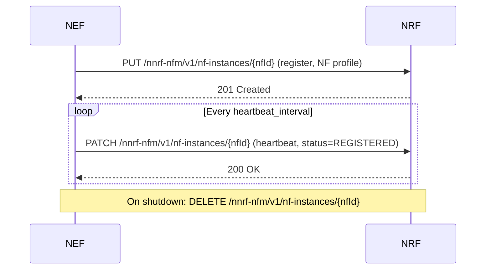
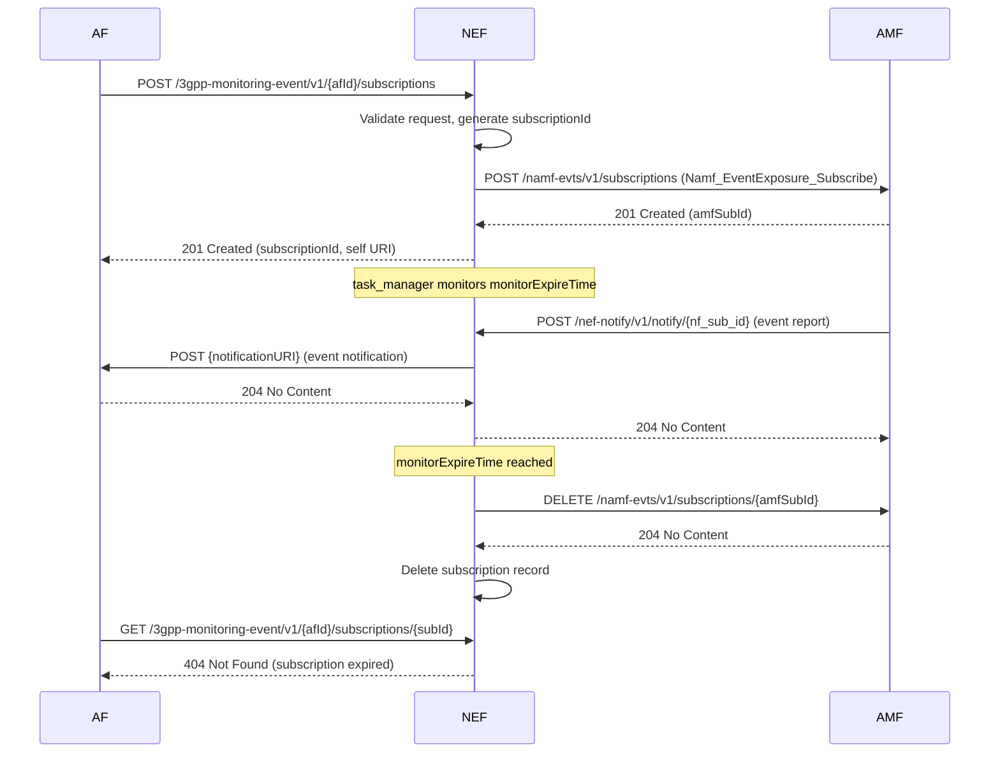
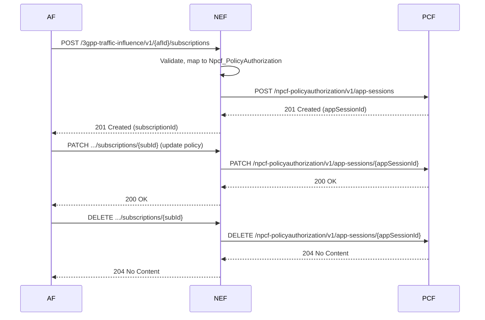
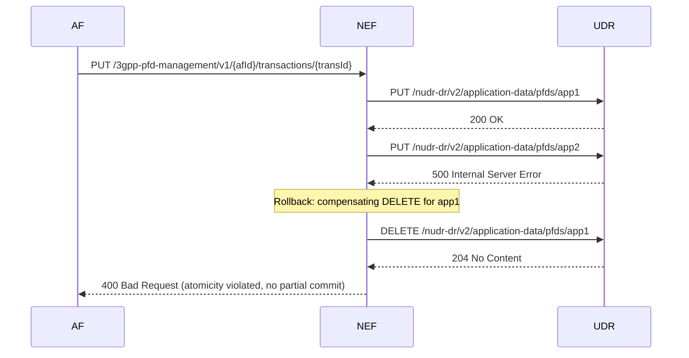
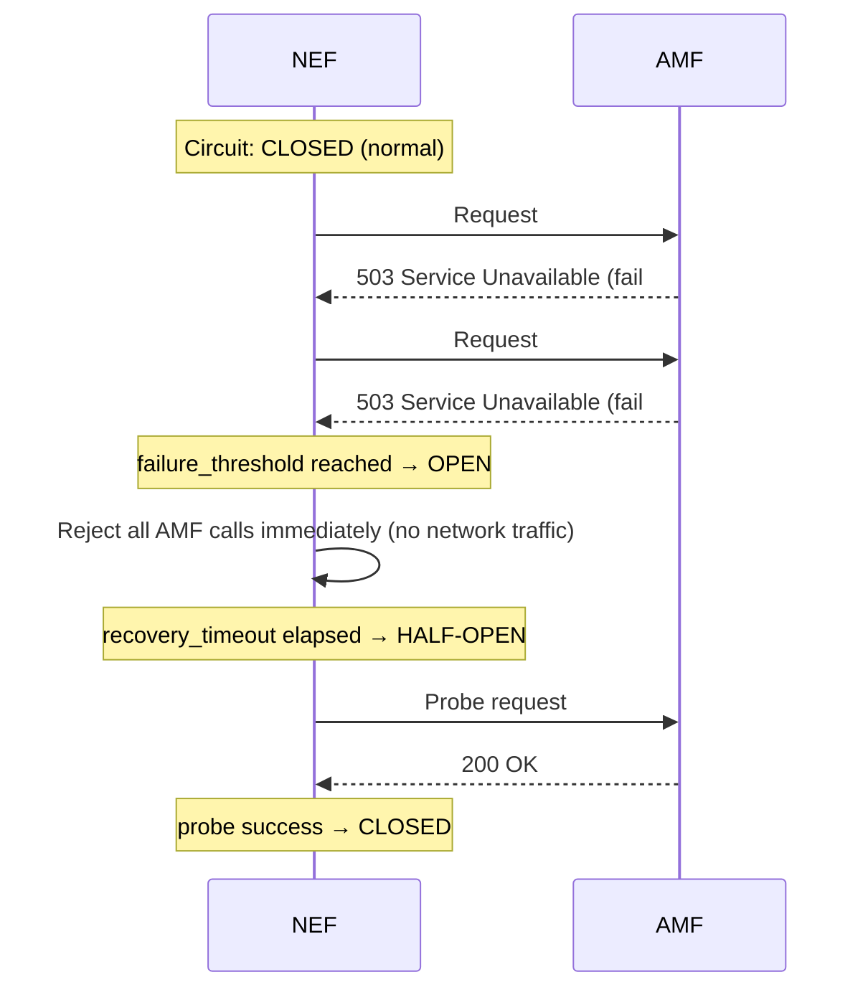
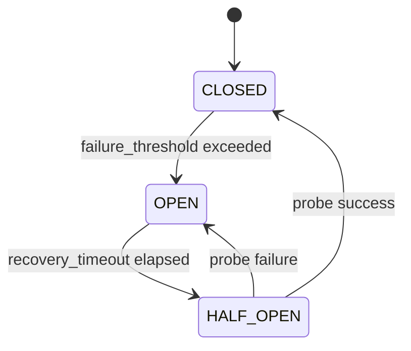

# Call Flows

This document shows the interactions between OAI NEF and external entities — AFs, NRF, AMF, SMF, PCF, and UDR — for key operations. Each diagram covers one complete flow from request initiation to final response, including error and expiry paths where relevant.

---

## 1. NRF Registration and Heartbeat

At startup, NEF registers its NF profile with NRF using a `PUT` to the NF management endpoint. The profile includes the NF type (`NEF`), IP address, SBI port, and the list of services NEF provides. Once registered, `task_manager` issues a periodic heartbeat `PATCH` to keep the registration alive. On graceful shutdown, NEF deregisters with a `DELETE`.

**Key points**:

- If the initial `PUT` fails (NRF unreachable), NEF retries with exponential backoff.
- If `nfStatus` in the `/health` response shows `UNDISCOVERABLE`, the heartbeat loop has stopped or the initial registration failed. Check `NRF_FQDN` and `NRF_PORT`.
- On abnormal exit (SIGKILL, crash), the `DELETE` is not sent. NRF will eventually expire the registration based on its own TTL policy.

---

## 2. Monitoring Event Subscription (with Expiry)

When an AF creates a monitoring event subscription, NEF validates the request, persists it in memory, and immediately proxies a corresponding `Namf_EventExposure_Subscribe` request southbound to AMF. When the AMF detects the subscribed event it delivers a notification to NEF's internal callback; NEF translates it and forwards it to the AF's `notificationURI`. When `monitorExpireTime` is reached, NEF automatically cancels both the southbound AMF subscription and its own record.

**Key points**:

- The AF's `notificationURI` must be reachable from the NEF container. In Docker Compose deployments, use the Docker service name rather than `localhost`.
- If the AF returns anything other than `2xx` for the notification, NEF logs the error but does not retry in this release.
- If NEF restarts after creating the subscription, the in-memory record is lost. See [Resilience — In-Memory State](resilience.md#in-memory-state-and-restart-behavior).

---

## 3. Traffic Influence Policy

The Traffic Influence API allows AFs to steer traffic for specific UEs or application flows. NEF maps the northbound T8 subscription to a `Npcf_PolicyAuthorization` application session on PCF. Updates and deletions are propagated southbound to PCF with matching PATCH and DELETE operations.

**Key points**:

- NEF maintains the mapping between its own `subscriptionId` and the PCF `appSessionId` in memory.
- If PCF returns an error on `POST`, NEF returns the error to the AF and does not persist the subscription.
- PCF circuit-breaker state is independent of AMF and UDR circuit states.

---

## 4. PFD Management Atomic Batch (with Rollback)

PFD (Packet Flow Description) transactions are atomic: either all application PFDs in a `PUT` transaction succeed, or none are committed. If any individual UDR write fails, NEF issues compensating `DELETE` calls for all previously written PFDs in that transaction before returning an error to the AF.

**Key points**:

- Atomicity is enforced by `nef_pfd_atomicity` (see [Architecture](architecture.md#module-reference)).
- If the rollback `DELETE` also fails, NEF logs the inconsistency and still returns `400` to the AF. Manual reconciliation against UDR may be required.
- A successful transaction returns `200 OK` with the stored PFD objects.

---

## 5. Circuit Breaker State Transitions (NF Connectivity)

Each southbound NF connection (AMF, SMF, PCF, UDR) has an independent circuit breaker. When consecutive failures reach `failure_threshold`, the circuit trips to OPEN and NEF rejects all calls to that NF immediately — no network request is made — protecting both NEF and the failing NF from request pile-up. After `recovery_timeout` the circuit enters HALF-OPEN and allows one probe request through. A successful probe returns the circuit to CLOSED; a failed probe returns it to OPEN.

**State transition diagram**:

**Key points**:

- Circuit breaker state is scoped **per NF instance (NF ID)**. An open AMF circuit does not affect the PCF or UDR circuits.
- When a circuit is OPEN, NEF returns `503 Service Unavailable` to the requesting AF immediately.
- Configuration parameters (`failure_threshold`, `recovery_timeout`) are described in [Resilience](resilience.md#configuration) and the [Configuration Reference](configuration-reference.md).
