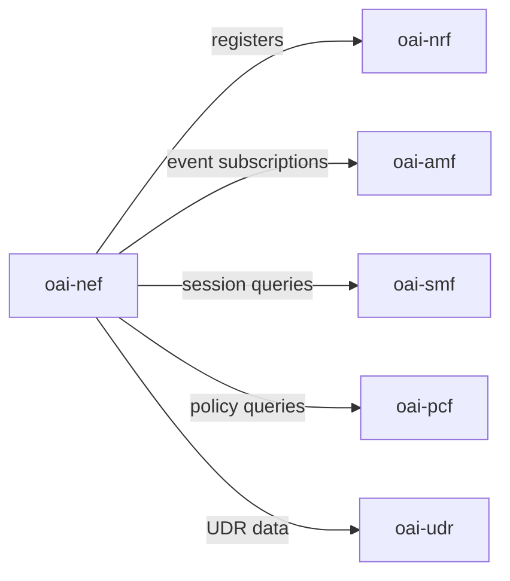

# Deployment Guide

## 1. Docker Image Variants

OAI NEF provides Dockerfiles for three Linux distributions. Choose the variant that matches your target environment:

| Dockerfile | Base OS | Use Case |
|------------|---------|----------|
| `docker/Dockerfile.nef.ubuntu` | Ubuntu 20.04 (Focal) | Default; used in CI/CD pipelines and integration testing |
| `docker/Dockerfile.nef.rhel8` | Red Hat Enterprise Linux 8 | RHEL-certified environments and Red Hat OpenShift |
| `docker/Dockerfile.nef.rocky8` | Rocky Linux 8 | Open-source RHEL-compatible alternative |

All three images produce the same NEF binary and accept the same environment variables and configuration file. The Ubuntu image is the actively tested default for CI.

---

## 2. Running with Docker (Single Container)

The minimal command to start NEF as a standalone container is:

```bash
docker run -d \
  --name oai-nef \
  -v $(pwd)/etc/config.yaml:/openair-nef/etc/config.yaml \
  -p 8080:8080 \
  oai-nef:latest
```

**Notes:**

- NEF reads its configuration from `/openair-nef/etc/config.yaml` inside the container. Mount your local `etc/config.yaml` at that path as shown above.
- Port `8080` is the default SBI and northbound AF port. Adjust the `-p` mapping if your host already uses that port.
- To also expose the HTTP/2 secondary port: add `-p 9090:9090` and set `NEF_INTERFACE_HTTP2_PORT_FOR_SBI=9090` in the environment.
- For development with `insecure_dev_mode: true`, no additional auth setup is required. For production, mount a config file with `jwt_secret` set and `insecure_dev_mode: false`.

Verify the container is healthy:

```bash
curl -s --http2-prior-knowledge http://localhost:8080/health | python3 -m json.tool
```

---

## 3. Docker Compose Deployment

NEF is typically deployed as part of a full 5G Core stack alongside NRF, AMF, SMF, PCF, and UDR. The service dependency order is: NRF must be running before any other NF registers with it; NEF depends on NRF at startup but communicates with AMF, SMF, PCF, and UDR at runtime as needed.

### Service Topology



### Minimal docker-compose.yaml

```yaml
version: '3.8'

services:
  oai-nrf:
    image: oai-nrf:latest
    container_name: oai-nrf
    environment:
      - TZ=Europe/Paris
      - NRF_INTERFACE_NAME_FOR_SBI=eth0
      - NRF_INTERFACE_PORT_FOR_SBI=80
      - NRF_INTERFACE_HTTP2_PORT_FOR_SBI=9090
      - NRF_API_VERSION=v1
    networks:
      oai-5gc-net:
        ipv4_address: 192.168.28.193
    healthcheck:
      test: ["CMD", "curl", "-f", "http://localhost:80/health"]
      interval: 10s
      timeout: 5s
      retries: 5

  oai-nef:
    image: oai-nef:latest
    container_name: oai-nef
    depends_on:
      oai-nrf:
        condition: service_healthy
    ports:
      - "8080:8080"
      - "9090:9090"
    environment:
      - TZ=Europe/Paris
      - NEF_INTERFACE_NAME_FOR_SBI=eth0
      - NEF_INTERFACE_PORT_FOR_SBI=8080
      - NEF_INTERFACE_HTTP2_PORT_FOR_SBI=9090
      - NEF_API_VERSION=v1
      - INSTANCE=0
      - PID_DIRECTORY=/var/run
      # NRF
      - NRF_IPV4_ADDRESS=192.168.28.193
      - NRF_FQDN=oai-nrf
      # AMF
      - AMF_IPV4_ADDRESS=192.168.28.194
      - AMF_PORT=80
      - AMF_HTTP2_PORT=9090
      - AMF_API_VERSION=v1
      - AMF_FQDN=oai-amf
      # SMF
      - SMF_IPV4_ADDRESS=192.168.28.195
      - SMF_PORT=80
      - SMF_HTTP2_PORT=9090
      - SMF_API_VERSION=v1
      - SMF_FQDN=oai-smf
      # PCF
      - PCF_IPV4_ADDRESS=192.168.28.196
      - PCF_PORT=80
      - PCF_HTTP2_PORT=9090
      - PCF_API_VERSION=v1
      - PCF_FQDN=oai-pcf
      # UDR
      - UDR_IPV4_ADDRESS=192.168.28.197
      - UDR_PORT=80
      - UDR_HTTP2_PORT=9090
      - UDR_API_VERSION=v1
      - UDR_FQDN=oai-udr
      # Address selection
      - USE_FQDN_DNS=no
    volumes:
      - ./etc/config.yaml:/openair-nef/etc/config.yaml:ro
    networks:
      oai-5gc-net:
        ipv4_address: 192.168.28.210
    healthcheck:
      test: ["CMD", "curl", "-f", "http://localhost:8080/health"]
      interval: 10s
      timeout: 5s
      retries: 3

networks:
  oai-5gc-net:
    name: oai-5gc-public-net
    driver: bridge
    ipam:
      config:
        - subnet: 192.168.28.192/26
```

**Notes:**

- Replace image tags (`oai-nrf:latest`, `oai-nef:latest`, etc.) with the specific version tags used in your environment.
- Set `USE_FQDN_DNS=yes` and replace `_IPV4_ADDRESS` entries with `_FQDN` entries if your Docker network uses DNS resolution instead of static IPs.
- Mount `etc/config.yaml` as read-only (`:ro`) to prevent the container from modifying your configuration.
- The `oai-amf`, `oai-smf`, `oai-pcf`, and `oai-udr` services are not shown above for brevity; add them with equivalent structure and matching IP addresses.

---

## 4. Port Reference

| Port | Protocol | Purpose |
|------|----------|---------|
| 8080/tcp | HTTP/2 (h2c) | Default SBI and northbound AF port; NEF listens here for all API traffic |
| 9090/tcp | HTTP/2 (h2c) | Alternative HTTP/2 port; configurable via `NEF_INTERFACE_HTTP2_PORT_FOR_SBI` |

Both ports speak HTTP/2 cleartext (`h2c`). There is no TLS at the application layer; deploy behind a TLS-terminating proxy for production (see the [Security Guide](security.md#8-known-limitations)).

---

## 5. Environment Variables Reference

Environment variables override the corresponding `etc/config.yaml` parameters when set. This allows the same Docker image to be configured for different environments without modifying the config file.

| Variable | Config Parameter | Default | Description |
|----------|-----------------|---------|-------------|
| `NEF_INTERFACE_NAME_FOR_SBI` | `nef.sbi.interface_name` | `eth0` | Network interface name that NEF binds to for SBI traffic |
| `NEF_INTERFACE_PORT_FOR_SBI` | `nef.sbi.port` | `80` | HTTP/1.1 listen port |
| `NEF_INTERFACE_HTTP2_PORT_FOR_SBI` | `nef.sbi.port` (HTTP/2) | `9090` | HTTP/2 listen port |
| `NEF_API_VERSION` | `nef.sbi.api_version` | `v1` | API version string used in all path prefixes |
| `INSTANCE` | — | `0` | Instance identifier; used to disambiguate multiple NEF instances in logs |
| `PID_DIRECTORY` | — | `/var/run` | Directory for the NEF PID file |
| `NRF_IPV4_ADDRESS` | `nfs.nrf.host` | — | NRF IP address (used when `USE_FQDN_DNS=no`) |
| `NRF_FQDN` | `nfs.nrf.host` | — | NRF FQDN (used when `USE_FQDN_DNS=yes`) |
| `AMF_IPV4_ADDRESS` | `nfs.amf.host` | — | AMF IP address (used when `USE_FQDN_DNS=no`) |
| `AMF_PORT` | `nfs.amf.sbi.port` | `80` | AMF HTTP/1.1 SBI port |
| `AMF_HTTP2_PORT` | `nfs.amf.sbi.port` (HTTP/2) | `9090` | AMF HTTP/2 SBI port |
| `AMF_API_VERSION` | `nfs.amf.sbi.api_version` | `v1` | AMF API version |
| `AMF_FQDN` | `nfs.amf.host` | `cicd-oai-amf` | AMF FQDN (used when `USE_FQDN_DNS=yes`) |
| `SMF_IPV4_ADDRESS` | `nfs.smf.host` | — | SMF IP address |
| `SMF_PORT` | `nfs.smf.sbi.port` | `80` | SMF HTTP/1.1 port |
| `SMF_HTTP2_PORT` | `nfs.smf.sbi.port` (HTTP/2) | `9090` | SMF HTTP/2 port |
| `SMF_API_VERSION` | `nfs.smf.sbi.api_version` | `v1` | SMF API version |
| `SMF_FQDN` | `nfs.smf.host` | `cicd-oai-smf` | SMF FQDN |
| `PCF_IPV4_ADDRESS` | `nfs.pcf.host` | — | PCF IP address |
| `PCF_PORT` | `nfs.pcf.sbi.port` | `80` | PCF HTTP/1.1 port |
| `PCF_HTTP2_PORT` | `nfs.pcf.sbi.port` (HTTP/2) | `9090` | PCF HTTP/2 port |
| `PCF_API_VERSION` | `nfs.pcf.sbi.api_version` | `v1` | PCF API version |
| `PCF_FQDN` | `nfs.pcf.host` | `cicd-oai-pcf` | PCF FQDN |
| `UDR_IPV4_ADDRESS` | `nfs.udr.host` | — | UDR IP address |
| `UDR_PORT` | `nfs.udr.sbi.port` | `80` | UDR HTTP/1.1 port |
| `UDR_HTTP2_PORT` | `nfs.udr.sbi.port` (HTTP/2) | `9090` | UDR HTTP/2 port |
| `UDR_API_VERSION` | `nfs.udr.sbi.api_version` | `v1` | UDR API version |
| `UDR_FQDN` | `nfs.udr.host` | `cicd-oai-udr` | UDR FQDN |
| `USE_FQDN_DNS` | — | `no` | Set to `yes` to resolve peer NF addresses by FQDN instead of static IP |

---

## 6. Health Check Integration

NEF exposes a `GET /health` endpoint that can be used as a Docker `HEALTHCHECK`, Kubernetes liveness/readiness probe, or monitored by any HTTP-aware load balancer.

### Docker HEALTHCHECK

```dockerfile
HEALTHCHECK --interval=10s --timeout=5s --retries=3 \
  CMD curl -f http://localhost:8080/health || exit 1
```

### Response Schema

A healthy NEF instance returns `200 OK` with the following JSON body:

```json
{
  "status": "OK",
  "draining": false,
  "uptime": 3600,
  "instanceId": "a1b2c3d4-e5f6-7890-abcd-ef1234567890"
}
```

| Field | Type | Description |
|-------|------|-------------|
| `status` | string | `"OK"` when the instance is healthy and accepting requests |
| `draining` | boolean | `true` after NEF receives SIGTERM; new requests are rejected with `503` while in-flight requests complete |
| `uptime` | integer | Seconds elapsed since the NEF process started |
| `instanceId` | string (UUID) | Unique identifier for this NEF process instance; useful for correlating logs in multi-container environments |

### Kubernetes Probe Example

```yaml
livenessProbe:
  httpGet:
    path: /health
    port: 8080
  initialDelaySeconds: 15
  periodSeconds: 10
  timeoutSeconds: 5
  failureThreshold: 3

readinessProbe:
  httpGet:
    path: /health
    port: 8080
  initialDelaySeconds: 5
  periodSeconds: 5
  timeoutSeconds: 3
  failureThreshold: 2
```

---

## 7. Graceful Shutdown

NEF handles `SIGTERM` (the signal sent by `docker stop` and Kubernetes pod termination) with a graceful drain sequence:

1. **Sets `draining: true`** in the `/health` endpoint response so load balancers and readiness probes can detect the shutdown.
2. **Stops accepting new requests**: all new connections and streams receive `503 Service Unavailable`.
3. **Allows in-flight requests to complete**: active HTTP/2 streams that were already dispatched to handler threads are allowed to finish normally.
4. **Deregisters from NRF**: NEF sends a deregistration request to the NRF so that other NFs stop attempting to route traffic to this instance.
5. **Exits cleanly**: the process exits with code `0` after all in-flight work has drained.

For Docker deployments, `docker stop oai-nef` sends SIGTERM and waits up to 10 seconds (the Docker default) before sending SIGKILL. If your in-flight request workload requires more time, increase the stop timeout:

```bash
docker stop --time 30 oai-nef
```

For Docker Compose, set `stop_grace_period` on the `oai-nef` service:

```yaml
oai-nef:
  stop_grace_period: 30s
```

---

## 8. Known Operational Limitations

> **Note**: The limitations below are architectural constraints in the current release. They inform capacity planning, deployment topology decisions, and AF integration design. Check the [CHANGELOG.md](../CHANGELOG.md) for updates in future releases.

### No Persistence

All active subscriptions (monitoring event, traffic influence, PFD, QoS, BDT, analytics) are stored **in memory only**. A NEF restart — whether planned (upgrade, config change) or unplanned (crash, OOM kill) — permanently loses all subscription state. There is no persistent store or write-ahead log.

**Implication for AF developers**: AFs must detect subscription loss. When a subscription ID that was previously valid returns `404 Not Found`, the AF must re-create the subscription from scratch. It is recommended to implement a startup reconciliation loop on the AF side. Allow a **60-second readiness window** after NEF restart before directing full AF traffic to give the new instance time to register with NRF and stabilize.

### No HA / Clustering

NEF supports **single-instance deployment only**. There is no active-active or active-passive redundancy mechanism. Running two NEF containers behind a load balancer will result in split subscription state — each instance holds only the subscriptions created against it, and notifications may be delivered to the wrong instance or lost.

### No Prometheus Metrics

NEF does not expose a `/metrics` endpoint in Prometheus or OpenMetrics format. Operational monitoring must be performed via:

- The `/health` endpoint for liveness and drain state.
- Structured application logs (controlled by `log_level.general` in `config.yaml`).
- Container-level metrics (CPU, memory, network I/O) via the Docker or Kubernetes runtime.

### No Kubernetes Helm Chart

No official Helm chart is provided in this repository. Kubernetes deployments require custom manifests. Refer to the service topology in [Section 3](#3-docker-compose-deployment) and the environment variable table in [Section 5](#5-environment-variables-reference) when writing Kubernetes Deployment and Service resources.

### HTTP/2 Cleartext (h2c) Only

NEF does not terminate TLS at the application layer. All HTTP/2 traffic is cleartext (`h2c`). For production deployments, place NEF behind a TLS-terminating reverse proxy (Envoy, nginx, HAProxy) and ensure the proxy-to-NEF leg operates on a trusted internal network segment only.

### Subscription Loss on Restart

This is a restatement of the "No Persistence" limitation above, highlighted separately because it has a direct impact on AF integration testing and staged rollout procedures. When performing a rolling update or config-change restart of the NEF container, coordinate with all connected AFs to re-subscribe after NEF comes back online. A health-gate in your CI/CD pipeline that waits for `/health` to return `"draining": false` before routing AF traffic is strongly recommended.
