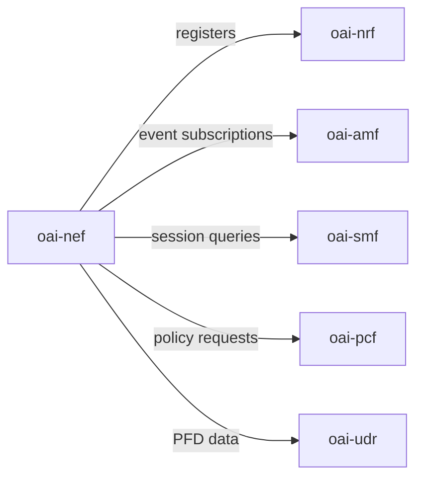

<!-- SPDX-License-Identifier: CC-BY-4.0 -->

# Deployment Guide

This guide covers building and running NEF as a container, wiring it into a 5G core, and the health
and shutdown behaviour you need for orchestration. It was checked against the Dockerfiles in
`docker/`, `scripts/healthcheck.sh`, and the compose template in `ci-scripts/docker-compose/`.

For the parameters in `config.yaml`, see the [Configuration Reference](configuration-reference.md).
For the `/health` and notification endpoints, see
[Operational Endpoints](api-reference/operational-endpoints.md).

---

## 1. Docker image variants

Three Dockerfiles are provided, one per base OS. All three build the same `oai_nef` binary and
accept the same configuration.

| Dockerfile | Base image | Notes |
|------------|-----------|-------|
| `docker/Dockerfile.nef.ubuntu` | `ubuntu:focal` (also builds on 22.04 jammy) | The actively tested default for CI |
| `docker/Dockerfile.nef.rhel9` | `registry.access.redhat.com/ubi9/ubi-minimal` | RHEL / OpenShift environments |
| `docker/Dockerfile.nef.rocky8` | `rockylinux:8` | Open-source RHEL-compatible alternative |

Each image runs the same entrypoint and command:

```dockerfile
ENTRYPOINT ["python3", "/openair-nef/bin/entrypoint.py"]
CMD ["/openair-nef/bin/oai_nef", "-c", "/openair-nef/etc/config.yaml", "-o"]
```

The entrypoint rewrites `config.yaml` from environment variables (see
[Section 5](#5-environment-variables)), then execs `oai_nef`. `-c` names the config file and `-o`
sends logs to stdout.

The images `EXPOSE 80/tcp 9090/tcp`: port 80 for HTTP/1.1 and 9090 for HTTP/2. The port NEF
actually listens on comes from `nfs.nef.sbi.port` in the effective config, so it depends on what
the entrypoint or your mounted file sets.

---

## 2. Running a single container

```bash
docker run -d \
  --name oai-nef \
  -v $(pwd)/etc/config.yaml:/openair-nef/etc/config.yaml:ro \
  -p 8080:8080 \
  oai-nef:latest
```

Notes:

- NEF reads `/openair-nef/etc/config.yaml`. Mount your file there. Read-only (`:ro`) keeps the
  container from rewriting it.
- Map the port your config listens on. The shipped template uses `8080`; the image's `EXPOSE`
  metadata names `80` and `9090`. Adjust `-p` to match your `nfs.nef.sbi.port`.
- NEF speaks cleartext HTTP/2 (h2c) only when `http_version: 2` is set; otherwise HTTP/1.1. There
  is no application-layer TLS.
- For local development the shipped config has `insecure_dev_mode: true`, so no credentials are
  needed. For anything reachable, set `jwt_secret` or an `af_whitelist` and set
  `insecure_dev_mode: false` — see the [Security Guide](security.md).

To probe `/health` you need an HTTP/2 client, because the endpoint is h2c:

```bash
curl --http2-prior-knowledge http://localhost:8080/health
```

A plain HTTP/1.1 `curl` gets no usable response even from a healthy NEF.

---

## 3. Docker Compose deployment

NEF runs as part of a 5G core alongside NRF, AMF, SMF, PCF, and UDR. NRF must be up first, because
NEF registers with it at startup; NEF reaches the other peers at runtime as requests arrive.

### Service topology



### Compose example

The example mounts a full `config.yaml` for peer addressing and sets only the NEF interface
variables the shipped template (`ci-scripts/docker-compose/docker-compose.tplt`) demonstrates.
Mounting the file is the reliable way to configure peers the entrypoint does not cover (NRF, PCF,
UDR).

```yaml
services:
  oai-nrf:
    image: oai-nrf:latest
    container_name: oai-nrf
    networks:
      oai-5gc-net:
        ipv4_address: 192.168.28.193

  oai-nef:
    image: oai-nef:latest
    container_name: oai-nef
    depends_on:
      - oai-nrf
    ports:
      - "8080:8080"
    environment:
      - TZ=Europe/Paris
      - NEF_INTERFACE_NAME_FOR_SBI=eth0
      - NEF_INTERFACE_PORT_FOR_SBI=80
      - NEF_INTERFACE_HTTP2_PORT_FOR_SBI=9090
      - NEF_API_VERSION=v1
      - INSTANCE=0
      - PID_DIRECTORY=/var/run
      # AMF / SMF / UDM peers (the variables the template demonstrates)
      - AMF_IPV4_ADDRESS=192.168.28.194
      - AMF_PORT=80
      - AMF_HTTP2_PORT=9090
      - AMF_API_VERSION=v1
      - AMF_FQDN=oai-amf
      - SMF_IPV4_ADDRESS=192.168.28.195
      - SMF_PORT=80
      - SMF_HTTP2_PORT=9090
      - SMF_API_VERSION=v1
      - SMF_FQDN=oai-smf
      - UDM_IPV4_ADDRESS=192.168.28.199
      - UDM_PORT=80
      - UDM_HTTP2_PORT=9090
      - UDM_API_VERSION=v1
      - UDM_FQDN=oai-udr
      - USE_FQDN_DNS=no
      - USE_HTTP2=no
    volumes:
      - ./etc/config.yaml:/openair-nef/etc/config.yaml:ro
    networks:
      oai-5gc-net:
        ipv4_address: 192.168.28.210

networks:
  oai-5gc-net:
    name: oai-5gc-public-net
    driver: bridge
    ipam:
      config:
        - subnet: 192.168.28.192/26
```

Notes:

- Replace `:latest` tags with the versions you run.
- Set `USE_FQDN_DNS=yes` to have the entrypoint use the `_FQDN` variables instead of the
  `_IPV4_ADDRESS` ones.
- Set `USE_HTTP2=yes` (and `http_version: 2` in the mounted config) to serve h2c on the HTTP/2 port.
- The template exposes AMF/SMF/UDM through environment variables only. Configure NRF, PCF and the
  remaining peers through the mounted `config.yaml` under `nfs.*`.
- Do not use the shipped `config.yaml` as-is on a reachable network: it has `insecure_dev_mode:
  true`.

---

## 4. Port reference

| Port | Set by | Purpose |
|------|--------|---------|
| 80/tcp | `EXPOSE`, `NEF_INTERFACE_PORT_FOR_SBI` | HTTP/1.1 listen port |
| 9090/tcp | `EXPOSE`, `NEF_INTERFACE_HTTP2_PORT_FOR_SBI` | HTTP/2 (h2c) listen port |
| 8080/tcp | `nfs.nef.sbi.port` in the shipped template | The port the template's config listens on |

The listen port is whatever `nfs.nef.sbi.port` resolves to. Whether it speaks HTTP/1.1 or h2c is
set by `http_version` (default `1.1`). There is no TLS at the application layer and no separate
admin port; for production, terminate TLS in a reverse proxy on a trusted network segment (see the
[Security Guide](security.md#no-tls)).

---

## 5. Environment variables

The container entrypoint (`entrypoint.py`) maps environment variables onto `config.yaml` keys
before launching NEF. That script is part of the shared common-build tooling and is not in this
repository, so the full set cannot be verified from the NEF source. The variables below are the
ones demonstrated by `ci-scripts/docker-compose/docker-compose.tplt`; see the
[Configuration Reference](configuration-reference.md#environment-variables-docker) for the mapping
table.

| Variable | Maps to | Example |
|----------|---------|---------|
| `NEF_INTERFACE_NAME_FOR_SBI` | `nfs.nef.sbi.interface_name` | `eth0` |
| `NEF_INTERFACE_PORT_FOR_SBI` | `nfs.nef.sbi.port` (HTTP/1.1) | `80` |
| `NEF_INTERFACE_HTTP2_PORT_FOR_SBI` | `nfs.nef.sbi.port` (HTTP/2) | `9090` |
| `NEF_API_VERSION` | `nfs.nef.sbi.api_version` | `v1` |
| `INSTANCE` | instance identifier | `0` |
| `PID_DIRECTORY` | PID file directory | `/var/run` |
| `AMF_IPV4_ADDRESS` / `AMF_FQDN` | `nfs.amf.host` | `192.168.28.194` / `oai-amf` |
| `AMF_PORT` / `AMF_HTTP2_PORT` | `nfs.amf.sbi.port` | `80` / `9090` |
| `AMF_API_VERSION` | `nfs.amf.sbi.api_version` | `v1` |
| `SMF_IPV4_ADDRESS` / `SMF_FQDN` | `nfs.smf.host` | `192.168.28.195` / `oai-smf` |
| `SMF_PORT` / `SMF_HTTP2_PORT` | `nfs.smf.sbi.port` | `80` / `9090` |
| `SMF_API_VERSION` | `nfs.smf.sbi.api_version` | `v1` |
| `UDM_IPV4_ADDRESS` / `UDM_FQDN` | `nfs.udr.host` | `192.168.28.199` / `oai-udr` |
| `UDM_PORT` / `UDM_HTTP2_PORT` | `nfs.udr.sbi.port` | `80` / `9090` |
| `UDM_API_VERSION` | `nfs.udr.sbi.api_version` | `v1` |
| `USE_FQDN_DNS` | selects `_FQDN` vs `_IPV4_ADDRESS` | `no` |
| `USE_HTTP2` | selects the HTTP port pair | `no` |

The template defines no `NRF_*`, `PCF_*`, or `UDR_*` variables; the UDR peer is addressed through
`UDM_*`. Configure any peer the entrypoint does not cover through the mounted `config.yaml`.

---

## 6. Health checks

NEF has two health mechanisms that check different things. Know which one you are using.

### What the container runs

The Dockerfiles set a `HEALTHCHECK` that runs the shipped script, not an HTTP request:

```dockerfile
HEALTHCHECK --interval=10s --timeout=15s --retries=6 \
  CMD /openair-nef/bin/healthcheck.sh
```

`scripts/healthcheck.sh` reads `nfs.nef.sbi.interface_name` and `nfs.nef.sbi.port` out of
`/openair-nef/etc/config.yaml` and checks, with `netstat`, that something is listening on that
port. It never opens an HTTP request. It proves the process is up, not that it is ready and not that
it is draining. This is deliberate: the runtime image ships no HTTP/2-capable client, so it cannot
probe the h2c `/health` endpoint from inside the container.

### The `/health` endpoint

`GET /health` reports serving-vs-draining state over h2c. It is unauthenticated and is the only
route exempt from the drain guard and the rate limiter, so it keeps answering during shutdown.

- `200` while serving: `{"status":"ok","nf_type":"NEF","instance_id":"…","uptime_seconds":N,"draining":false}`
- `503` while draining: `{"status":"draining","nf_type":"NEF"}`

The field is `uptime_seconds` (not `uptime`), `instance_id` (not `instanceId`), and `status` is
lowercase `ok`. The full schema is in
[Operational Endpoints](api-reference/operational-endpoints.md#get-health).

### Kubernetes probes

Because `/health` is h2c-only, an `httpGet` probe (which speaks HTTP/1.1) fails against a healthy
NEF. Use a `tcpSocket` probe, or an `exec` probe that runs the shipped script:

```yaml
livenessProbe:
  tcpSocket:
    port: 8080
  initialDelaySeconds: 10
  periodSeconds: 15
  failureThreshold: 3
readinessProbe:
  exec:
    command: ["/openair-nef/bin/healthcheck.sh"]
  initialDelaySeconds: 5
  periodSeconds: 10
```

Neither form tells draining from serving. To get that, the probe would need an `exec` running an
HTTP/2 client you add to the image yourself.

---

## 7. Graceful shutdown

NEF handles `SIGTERM` (sent by `docker stop` and Kubernetes pod termination) with a drain sequence:

1. **Sets draining state.** `/health` starts returning `503` with `{"status":"draining"}` so load
   balancers and readiness checks can react.
2. **Rejects new work.** New requests receive `503` with detail `"Server is draining"`. `/health`
   is exempt and keeps answering.
3. **Lets in-flight requests finish.** Streams already dispatched to worker threads run to
   completion.
4. **Deregisters from NRF**, so peers stop routing to this instance.
5. **Exits.**

For Docker, `docker stop` sends SIGTERM and waits 10 seconds (the default) before SIGKILL. Increase
it if in-flight work needs longer:

```bash
docker stop --time 30 oai-nef
```

For Compose, set `stop_grace_period`:

```yaml
oai-nef:
  stop_grace_period: 30s
```

---

## 8. Known operational limitations

These are architectural constraints in the current release. They affect capacity planning,
topology, and AF integration. Check [CHANGELOG.md](../CHANGELOG.md) for changes in later releases.

### No persistence

All subscription state (monitoring event, traffic influence, PFD, QoS, BDT, analytics) is held in
memory. Any restart — planned or not — loses it. There is no persistent store.

Implication for AF developers: detect subscription loss. When a previously valid subscription ID
returns `404`, re-create the subscription. Consider a reconciliation loop on the AF side, and allow
a readiness window after a NEF restart before sending full traffic, so the new instance can register
with NRF.

### No HA or clustering

NEF is single-instance only. There is no active-active or active-passive mode. Two NEF containers
behind a load balancer split subscription state — each holds only what was created against it, and
notifications can miss.

### No Prometheus metrics

There is no `/metrics` endpoint. Monitor with:

- `/health` for liveness and drain state.
- Application logs (`log_level.general`).
- Container-level CPU/memory/network metrics from the runtime.

### No Kubernetes Helm chart

No Helm chart or manifests ship in this repository. Kubernetes deployments need custom manifests;
use the topology in [Section 3](#3-docker-compose-deployment) and the variables in
[Section 5](#5-environment-variables) as a starting point.

### HTTP/2 cleartext only

NEF does not terminate TLS. When `http_version: 2`, traffic is h2c. Put NEF behind a
TLS-terminating proxy (Envoy, nginx, HAProxy) and keep the proxy-to-NEF leg on a trusted internal
segment. See the [Security Guide](security.md#no-tls).
