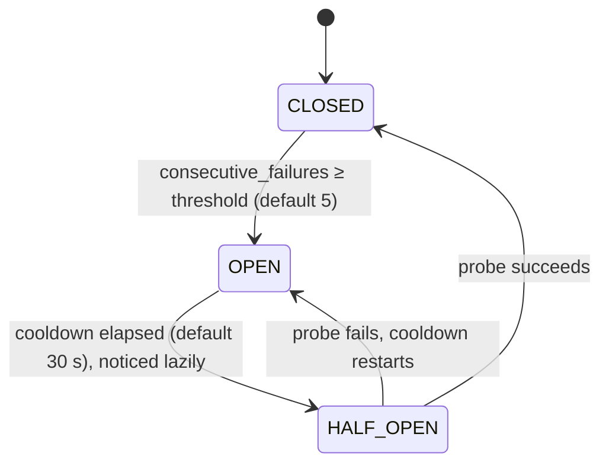

# Resilience and Fault Tolerance

## Overview

OAI NEF has three resilience mechanisms: two circuit-breaker registries and a
rate limiter. All three are process-wide singletons with built-in defaults;
none is configurable through `etc/config.yaml` in this release.

- **Southbound circuit breaker** — `sbi_circuit_breaker_registry`
  (`src/common/sbi_resilience.hpp`). Guards calls that go through
  `sbi_call_with_retry`: NRF registration, NRF discovery, and `nef_client`'s
  blocking SBI methods.
- **Northbound circuit breaker** — `circuit_breaker_registry`
  (`src/common/nef_retry_helper.hpp`). Guards AF notification delivery.
- **Rate limiter** — `nef_rate_limiter` (`src/common/nef_rate_limiter.hpp`). A
  per-caller token bucket on inbound HTTP/2 requests.

This page describes the behaviour and known limitations of each, plus the
in-memory state model that governs restart behaviour. For where these fit in
the request path and thread model, see [`ARCHITECTURE.md`](ARCHITECTURE.md)
(§7 concurrency, §10 southbound).

---

## Southbound Circuit Breaker

### What it protects

`sbi_circuit_breaker_registry` is a process-wide singleton keyed by **NF type**
— the strings `"NRF"`, `"AMF"`, `"SMF"`, `"PCF"`, `"UDR"`. It is **not** keyed
by NF instance ID, so all instances of one NF type share a single breaker.

The breaker is consulted only by calls routed through `sbi_call_with_retry`:

- NRF registration and NRF discovery (both keyed `"NRF"`).
- `nef_client`'s blocking SBI methods, keyed by their target NF type.

The southbound calls on the live request path use the asynchronous
`*_async` client methods, which issue their request directly through the async
HTTP client and **do not** consult this breaker. In practice, then, the breaker
most visibly guards NRF registration and discovery. Many of the blocking twin
methods it would otherwise protect currently have no caller (see
[`ARCHITECTURE.md`](ARCHITECTURE.md) §12).

### States and transitions

- **CLOSED** — Normal operation. Any 2xx clears the failure count. A 4xx is
  treated as a permanent application error and does **not** count against the
  breaker. Only status 0 (connection failure) and 5xx failures that survive the
  retry budget increment the counter.
- **OPEN** — `sbi_call_with_retry` returns immediately with `-1` and sends
  nothing. The breaker itself does not produce an HTTP status; the caller maps
  the dropped call to a northbound response (for example, a discovery failure
  during a create surfaces as the handler's failure policy — often `500` or
  `502`, not a clean `503`).
- **HALF-OPEN** — Reached lazily: the transition from OPEN happens on the next
  `is_open()` call once the cooldown has elapsed, not on a timer. Exactly one
  probe is allowed through. A success closes the breaker; a failure reopens it
  and restarts the cooldown.

### Defaults

| Parameter | Default | Source |
|---|---|---|
| Failure threshold | 5 consecutive failures | `CB_THRESHOLD_DEFAULT` |
| Cooldown before HALF-OPEN | 30 s | `COOLDOWN_SECS_DEFAULT` |

Retries within a single call back off 200 ms, 400 ms, 800 ms with ±10% jitter,
up to four attempts. POSTs are retried only on a connection failure (status 0),
because a 503 or 429 means the NF did receive the request. These are
compile-time constants in `sbi_resilience.hpp`; there is no YAML key for them.

---

## Northbound Circuit Breaker (AF Notifications)

AF notification delivery has its own, simpler breaker,
`circuit_breaker_registry` in `nef_retry_helper.hpp`. It is a separate
process-wide singleton and behaves differently from the southbound one.

- **Keyed by endpoint** — scheme, host and port of the AF callback URI, so
  every path on one AF shares a breaker.
- **Threshold 10** consecutive failures trips it open.
- **No cooldown and no half-open probe.** Once open, `retry_with_backoff`
  sends nothing, so no success can arrive to close it on its own — only an
  explicit `record_success()` or `reset_all()` from elsewhere clears it.
- **A 4xx counts as a failure here** (unlike the southbound breaker), because
  the counter tracks endpoint reachability and response health together.

Each delivery attempt is retried with a 1 s, 2 s, 4 s backoff, up to three
attempts (`forward_notification_to_af`). See
[Call Flows — Monitoring Event](call-flows.md#2-monitoring-event-subscription-with-expiry)
for how a notification travels from a southbound NF through NEF to the AF.

---

## Rate Limiter

### Scope and behaviour

The rate limiter is a **per-caller token bucket**, not a global one. It is
enforced in `begin_request()` on every route except `/health`, using
`nef_rate_limiter`.

- **Key** — the caller's bearer token, falling back to the peer address when no
  token is present. Each key gets its own bucket.
- **Rate** — 100 tokens/second sustained, with a burst capacity of 200 tokens
  (a new bucket starts full). These are built-in defaults; there is no YAML key
  for them in this release.
- **Enforcement point** — before authorization. The token string is read from
  the `Authorization` header but is not validated at this stage, so an invalid
  or unverified token still gets its own bucket.
- **Response** — a caller that runs out of tokens gets `429 Too Many Requests`
  with a Problem Details body (`title: "Too Many Requests"`, detail
  `"Rate limit exceeded"`).
- **`/health` is exempt** — it bypasses the drain guard and the rate limiter so
  an orchestrator can always read NEF's state.

### Known limitation

Because the key is the raw bearer token (or peer address), callers that present
no token and share a source address — for example, several clients behind one
proxy — share a single bucket and can throttle one another. Grouping by a
validated, stable AF identity is not implemented.

---

## In-Memory State and Restart Behaviour

All subscription state — monitoring event, traffic influence, PFD, BDT, QoS,
and analytics — is held exclusively in memory. There is no database or
persistent storage behind it in this release (see
[`ARCHITECTURE.md`](ARCHITECTURE.md) §12).

**Consequences of a NEF restart** (planned or crash):

- All existing subscriptions are lost immediately.
- Southbound subscriptions NEF created (for example on AMF or PCF) are **not**
  cleaned up on an abnormal exit (SIGKILL, OOM, crash). The southbound NF keeps
  the stale subscription until it expires by its own TTL or is removed
  manually.
- AFs receive no further notifications for subscriptions that predate the
  restart — NEF no longer holds the `notificationUri` to call.

**Recommended AF reconnection pattern**:

1. On reconnect or startup, `GET` each subscription the AF believes it created.
2. If the response is `404 Not Found`, re-create it with a fresh `POST`.
3. Do not assume a subscription from a previous session survives a NEF restart.

Persistent subscription storage is not implemented.

---

## NRF-Based Service Discovery

NEF resolves southbound NF endpoints (AMF, SMF, PCF, UDR) in a fixed order:

1. **Configuration first** — a statically configured endpoint for the NF type,
   if one is set.
2. **The discovery cache** — `nrf_discovery_cache`, a process-wide singleton
   keyed by NF type with a 30 s default TTL. An expired entry counts as a miss.
3. **NRF** — `Nnrf_NFDiscovery` (TS 29.510), whose result is written back into
   the cache.

**Startup behaviour**: if NRF is unreachable when NEF starts, NEF retries NRF
registration with exponential backoff through the southbound breaker (keyed
`"NRF"`). Note that `/health` does **not** reflect NRF registration state: once
the server is up it answers `200` with `status: "ok"` whether or not NRF
registration has succeeded. To check registration, read the logs (for example
`NEF successfully registered to NRF` or `NEF NRF registration failed`).

**Runtime behaviour**: after startup, discovered endpoints stay usable until
their cache TTL expires.

- Requests served from a configured or cached endpoint continue to work while
  NRF is down.
- A request that needs a fresh NRF lookup (cache miss, new NF type) fails with a
  southbound error until NRF recovers.

NRF unavailability does not cause NEF to deregister or shut down. The NRF
heartbeat fails and NEF logs `NRF heartbeat failed ... — will re-register`, but
it keeps serving AF requests from configured and cached endpoints.
