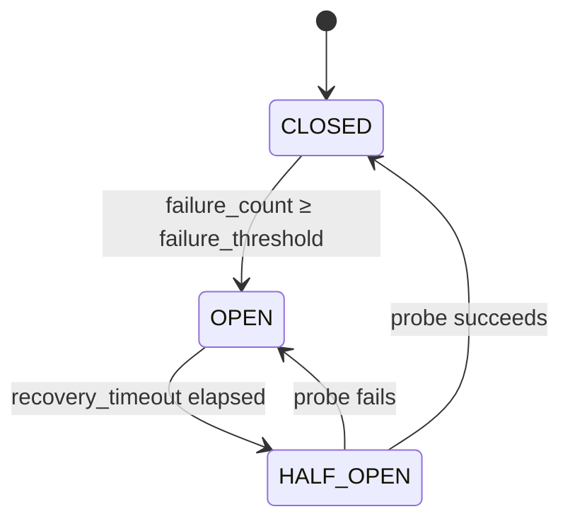

# Resilience and Fault Tolerance

## Overview

OAI NEF includes two built-in resilience mechanisms: **per-NF circuit breakers** and a **global rate limiter**. These protect both NEF and its southbound NFs from cascade failures and request floods. This page describes the behaviour, configuration, and known limitations of each mechanism, as well as the in-memory state model that affects restart behaviour.

---

## Circuit Breaker

### States and Transitions

Each southbound NF connection has an independent circuit breaker implemented in `sbi_resilience` (`src/nef_app/sbi_resilience.hpp`). The circuit moves through three states:

**State descriptions**:

- **CLOSED** — Normal operation. Requests flow through to the NF. Each error response (5xx, timeout, or connection refused) increments the failure counter. The counter resets on success.
- **OPEN** — Circuit is tripped. All requests to that NF are rejected immediately with `503 Service Unavailable` — no network call is made. This prevents NEF from accumulating blocked threads waiting for a non-responsive NF and stops amplifying load onto a struggling NF.
- **HALF-OPEN** — One probe request is allowed through to test whether the NF has recovered. If the probe succeeds, the circuit returns to CLOSED and normal traffic resumes. If the probe fails, the circuit returns to OPEN and `recovery_timeout` starts again.

### Per-NF-Type Instances

Circuit breaker state is maintained **per NF type** and **per NF instance (NF ID)**. AMF, SMF, PCF, and UDR each have completely independent circuit breaker state. An AMF circuit tripping to OPEN has no effect on the PCF or UDR circuits. When multiple instances of the same NF type are registered (e.g., two AMF instances), each instance has its own circuit.

| NF Type | Circuit Breaker Scope |
|---|---|
| AMF | Per AMF instance (NF ID) |
| SMF | Per SMF instance (NF ID) |
| PCF | Per PCF instance (NF ID) |
| UDR | Per UDR instance (NF ID) |

This isolation means a single degraded NF does not cause NEF to stop serving requests that rely on other NFs. For example, a PCF outage will cause traffic influence API calls to return `503`, but monitoring event subscriptions (which use AMF) will continue to function normally provided the AMF circuit is CLOSED.

### Configuration

| Parameter | Default | Description |
|---|---|---|
| `failure_threshold` | 5 | Number of consecutive failures before the circuit trips to OPEN. |
| `recovery_timeout` | 30s | Time the circuit stays in OPEN before transitioning to HALF-OPEN for a probe. |
| Circuit breaker enabled | Always | The circuit breaker is always active. Per-NF enable/disable is not configurable in this release. |

These parameters are set in `etc/config.yaml`. See [Configuration Reference](configuration-reference.md) for the full parameter table and YAML key names. The `nef_rate_limiter` configuration is also co-located in the same config section.

---

## Rate Limiter

### Scope and Behaviour

The rate limiter is **global** — it applies to all incoming API requests on the HTTP/2 server, regardless of which AF identity, API endpoint, or HTTP method is used. It is enforced in `nef_rate_limiter` (`src/nef_app/nef_rate_limiter.hpp`) using a token-bucket algorithm.

Key behavioural properties:

- If the incoming request rate exceeds the configured limit, NEF immediately returns `429 Too Many Requests` with a [Problem Detail](https://www.rfc-editor.org/rfc/rfc7807) response body.
- Rate limiting is enforced **before** authentication and authorization checks. A request that exceeds the rate limit is rejected without JWT validation or whitelist lookup.
- The rate limit window size and request threshold are set in the NEF configuration. See [Configuration Reference](configuration-reference.md) for the exact parameter names.

**Known limitation**: The rate limiter is global, not per-AF. A single AF with high request volume can consume the full token budget, causing `429` responses for all other AFs even if they are well-behaved. Per-AF rate limiting is not implemented in v1.5.1.

---

## In-Memory State and Restart Behaviour

All subscription state — monitoring event, traffic influence, PFD, BDT, and analytics — is held exclusively in memory. There is no database or persistent storage backing it in this release.

**Consequences of a NEF restart** (planned or crash):

- All existing subscriptions are lost immediately.
- Southbound NF subscriptions that NEF created on AMF and PCF are **not** cleaned up on an abnormal exit (SIGKILL, OOM, crash). The southbound NF retains stale subscriptions until they expire by their own TTL or are manually removed.
- AFs receive no further notifications for subscriptions that existed before the restart — NEF has no record of the `notificationURI` to call.

**Recommended AF reconnection pattern**:

1. On reconnect or startup, AF should `GET` each subscription it believes it created.
2. If the response is `404 Not Found`, re-create the subscription with a new `POST`.
3. AFs should not assume that a subscription created in a previous session is still active after a NEF restart.

This is a known limitation of v1.5.1. Persistent subscription storage backed by UDR or an external database is not yet implemented.

---

## NRF-Based Service Discovery

NEF uses NRF to discover the endpoints of southbound NFs (AMF, PCF, UDR). Discovery uses the `Nnrf_NFDiscovery` service (TS 29.510).

**Startup behaviour**: If NRF is unreachable when NEF starts, NEF retries NRF registration with exponential backoff. NEF will not mark itself `REGISTERED` (and `/health` will return `nfStatus: "UNDISCOVERABLE"`) until NRF registration succeeds.

**Runtime behaviour**: After successful startup, already-discovered NF endpoints are cached in memory. If NRF becomes unavailable after startup:

- Requests that use a cached NF endpoint continue to function (subject to the circuit breaker state for that NF).
- Requests that require a fresh NRF discovery lookup (e.g., first contact with a new NF instance) may fail with a southbound error until NRF recovers.

NRF unavailability does not cause NEF to deregister or shut down. The NRF heartbeat will fail but NEF continues serving AF requests using cached data.
