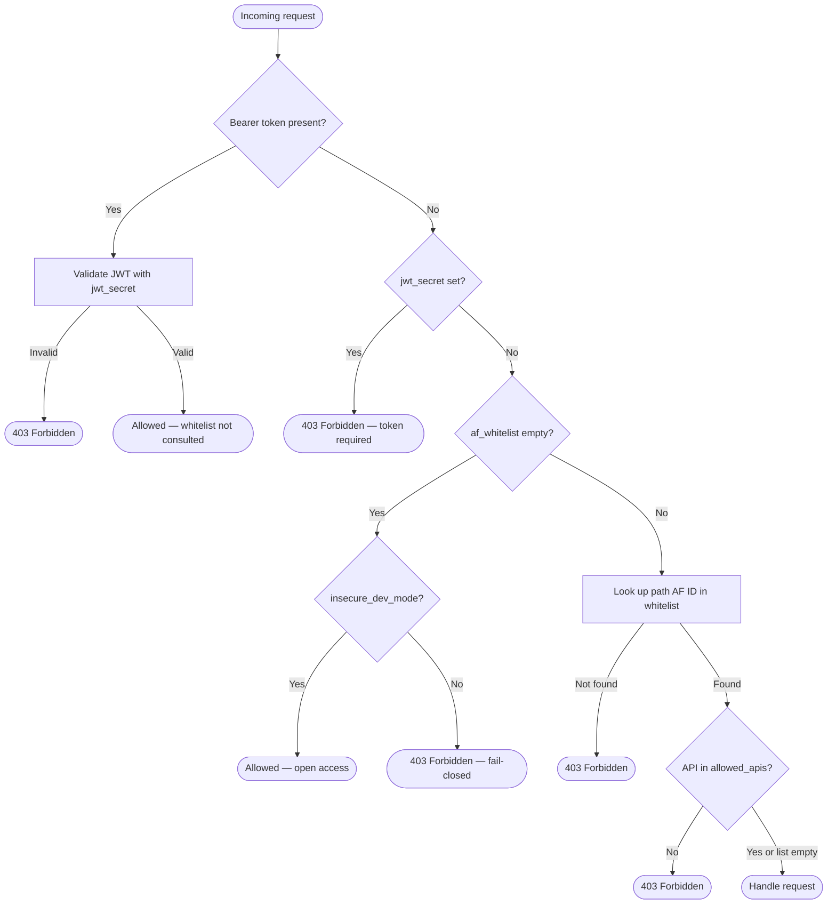

<!-- SPDX-License-Identifier: CC-BY-4.0 -->

# Security Guide

This guide describes how NEF actually authorizes callers, protects its notification callbacks, and
defends the HTTP/2 transport. Every claim was checked against the code that enforces it —
principally `authorize_af_request` (`src/nef_app/nef_app_core.cpp`), `nef_jwt`
(`src/nef_app/nef_jwt.cpp`), `validate_callback_uri` (`src/common/nef_callback_uri_validator.hpp`),
and the HTTP/2 server (`src/common-src/sba/http2_server.cpp`).

The [API Overview](api-reference/overview.md#authentication) is the companion summary for AF
developers; this page is the detailed reference.

---

## 1. What authorizes a request

NEF has one authorization mechanism: an **AF/NF allow-list check**. On top of it, when a JWT secret
is configured, NEF also **validates** a bearer token cryptographically. There is no working API-key
scheme (see [Section 4](#4-the-api_key-field-is-not-enforced)), and NEF never issues tokens of its
own.

**Every authorization failure is `403 Forbidden` with a ProblemDetails body. NEF never emits
`401`** — there is no `UNAUTHORIZED` status anywhere in its source. The detail string is:

- `"AF not authorized for this service"` on northbound (AF-facing) routes.
- `"NF not authorized for this Nnef service"` on Nnef (SBI) routes.

Three configuration keys decide the behaviour: `nef.security.jwt_secret`, `nef.af_whitelist`, and
`nef.security.insecure_dev_mode`.



A valid JWT is allowed immediately and the whitelist is not checked. Presenting a bearer token
while `jwt_secret` is empty fails validation and returns `403`; if you are not using JWT, send no
`Authorization` header.

---

## 2. Where the AF identity comes from

Each request is authorized against an **AF ID** (`af_id`). Its source depends on whether a bearer
token is present:

- **Bearer token present:** the JWT is validated, and its `sub` claim must equal the AF ID in the
  request URL path. A mismatch is a `403`.
- **No bearer token:** the AF ID is taken directly from the `{scsAsId}` / `{afId}` path parameter.
  Nothing cryptographic is verified. Authorization is then purely the allow-list check below.

So without JWT, the allow-list is keyed on the URL path AF ID. It restricts which AF IDs are
accepted, but it does not authenticate the caller — any client can put a listed AF ID in the path.
Configure `jwt_secret` when you need a verified identity.

The allow-list itself is the `nef.af_whitelist` config vector (`af_whitelist_entry_t`). Note that
this is separate from the `nef_af_profile` objects NEF keeps at runtime: those track active
subscriptions, not authorization.

For Nnef (SBI) routes, the consumer NF identity is the `sub` claim of the bearer token rather than a
path parameter (`authorize_nnef_request`); the same allow-list and rules then apply.

---

## 3. JWT bearer tokens (validation only)

NEF **validates** JWTs; it does not mint them. `nef_jwt::generate_token()` is a deliberate stub
that always returns `false`. Sign your tokens outside NEF with the shared secret and present them in
the `Authorization` header.

### Enabling validation

Set `nef.security.jwt_secret` to a non-empty string:

```yaml
nef:
  security:
    jwt_secret: "replace-with-a-strong-random-secret-32-bytes-or-more"
    insecure_dev_mode: false
```

An empty `jwt_secret` disables validation. When it is set, a request with no bearer token is
rejected with `403`.

### What `validate_af_token` checks

In order (`src/nef_app/nef_jwt.cpp`):

1. The `jwt_secret` must be configured, or validation fails closed.
2. The token must split into `header.payload.signature`.
3. The header `alg` must be exactly `HS256`. `none` and asymmetric algorithms are rejected.
4. The HMAC-SHA256 signature over `header.payload` must verify against `jwt_secret`.
5. The payload must contain a `scope` claim equal to the internal service name of the route being
   called (for example `nnef-eventexposure`; see the service-name table in the
   [Configuration Reference](configuration-reference.md#af-whitelist)).
6. The payload must contain a `sub` claim equal to the AF ID in the request URL path.
7. If an `exp` claim is present, the token must not be expired. A token without `exp` never expires.

Any failure means the request is rejected with `403`.

### Example payload

```json
{
  "sub": "my-af-1",
  "scope": "nnef-eventexposure",
  "iat": 1745539200,
  "exp": 1745625600
}
```

### Curl example

```bash
curl -s --http2-prior-knowledge \
  -H "Authorization: Bearer ${JWT_TOKEN}" \
  -H "Content-Type: application/json" \
  -d '{"eventType":"loss_of_connectivity","notificationURI":"http://af.example.com/notify","monitoringType":"SINGLE_UE","supi":"imsi-208950000000001"}' \
  http://oai-nef:8080/3gpp-monitoring-event/v1/my-af-1/subscriptions
```

`${JWT_TOKEN}` must have been signed elsewhere with the same `jwt_secret`, and its `sub` must be
`my-af-1` to match the path.

### Bearer token cross-thread safety {#bearer-token-cross-thread-safety}

NEF stores the in-progress request's bearer token in a `thread_local` variable
(`g_request_bearer_token` in `nef_app_core.cpp`). Because request handlers run on the dispatcher
worker pool, the HTTP worker that extracts the token and the dispatcher worker that runs `nef_app`
are different threads, so the value is not shared implicitly. `nef_app_adapter` bridges them:

1. The token is captured by value into the task lambda on the HTTP worker.
2. The dispatcher worker runs `execute_with_token(token, fn)`, which sets the `thread_local`, calls
   `fn`, then clears it in a RAII scope guard (`bearer_token_scope`) even if `fn` throws.
3. The HTTP worker never reads the token after enqueue.

In practice: the token is never logged or persisted, it is cleared before the worker picks up the
next task, and concurrent requests cannot observe each other's tokens. Do not set the `thread_local`
by hand when adding `execute_*` methods — route it through `execute_with_token`.

---

## 4. The `api_key` field is not enforced

Each `nef.af_whitelist` entry accepts an optional `api_key`, and `nef_af_profile` has a
`validate_api_key()` method. Neither is wired into request handling:

- No handler reads an `X-API-Key` (or any other) API-key header.
- `validate_api_key()` has no callers.
- `authorize_af_request` never inspects `entry.api_key`.

The field is parsed and echoed in diagnostics, but it grants and denies nothing. Treat it as
reserved. Do not rely on it for access control; use `jwt_secret` and the allow-list instead.

---

## 5. The AF allow-list

### Structure

`nef.af_whitelist` is a list of entries:

| Field | Type | Required | Description |
|-------|------|----------|-------------|
| `af_id` | string | yes | AF identifier; exact-match against the path AF ID (or the JWT `sub`) |
| `api_key` | string | no | Parsed but not enforced — see [Section 4](#4-the-api_key-field-is-not-enforced) |
| `allowed_apis` | list | no | Internal service names this AF may call; empty means all services |

`allowed_apis` values must be the internal service names (`nnef-eventexposure`,
`nnef-trafficinfluence`, `nnef-pfdmanagement`, `nnef-bdt`, `nnef-qosmonitoring`,
`nnef-analyticsexposure`). Other strings, such as `monitoring_event`, never match and effectively
deny the AF. The mapping is in the
[Configuration Reference](configuration-reference.md#af-whitelist).

### Matching rules

- `af_id` matching is exact string comparison — no wildcards, prefixes, or case-folding.
- With `allowed_apis` empty, the AF may call every service.
- With `allowed_apis` set, a request to a service not in the list returns `403`.

### Behaviour by configuration

| `af_whitelist` | `jwt_secret` | `insecure_dev_mode` | Result |
|----------------|--------------|---------------------|--------|
| empty | empty | `false` | Fail-closed: every request denied with `403` |
| empty | empty | `true` | Open access: every request allowed |
| empty | set | any | Valid JWT required; otherwise `403` |
| non-empty | empty | any | Allow-list by path AF ID; unlisted or disallowed API → `403` |
| non-empty | set | any | Valid JWT allowed immediately; otherwise the allow-list applies |

### Example

```yaml
nef:
  security:
    jwt_secret: "production-secret-minimum-32-bytes-long"
    insecure_dev_mode: false
  af_whitelist:
    # Unrestricted: may call any service
    - af_id: "platform-af"
    # Restricted: monitoring events only
    - af_id: "monitoring-af"
      allowed_apis:
        - nnef-eventexposure
```

---

## 6. `insecure_dev_mode` {#insecure_dev_mode}

`insecure_dev_mode` matters in exactly one situation: when no `jwt_secret` and no `af_whitelist` are
configured. In that case:

- `insecure_dev_mode: true` bypasses the allow-list and accepts every request. The AF ID is taken
  from the URL path with no verification, so any caller can claim any AF ID.
- `insecure_dev_mode: false` (the built-in default) fails closed and denies every request.

The shipped `etc/config.yaml` sets `insecure_dev_mode: true` for a frictionless first run. It has no
place in a shared, staged, or production deployment: it exposes every northbound service to
unauthenticated callers. Set a `jwt_secret` or a non-empty `af_whitelist`, and set
`insecure_dev_mode: false`, before NEF is reachable from any untrusted network. NEF logs a warning
at startup while it is enabled.

---

## 7. Callback URI filtering (SSRF protection)

Before NEF accepts a notification callback (`notifUri` / notification destination), it runs
`validate_callback_uri`. A rejected URI produces `400 Bad Request` with detail
`"notifUri: <reason>"`. This is the most common reason a lab subscription is rejected, because lab
AFs often sit on private or loopback addresses.

Rejected as malformed or unsupported:

- empty URI, or one with no `://`
- a scheme other than `http` or `https`
- an empty host, or an unclosed / invalid `[IPv6]` literal

Rejected by address range (to stop an AF pointing NEF at itself, at a cloud metadata endpoint, or
into the operator's private network):

| Family | Blocked ranges |
|--------|----------------|
| IPv4 | loopback `127.0.0.0/8`; link-local `169.254.0.0/16`; RFC 1918 `10.0.0.0/8`, `172.16.0.0/12`, `192.168.0.0/16` |
| IPv6 | loopback `::1`; link-local `fe80::/10`; ULA `fc00::/7` |

A host that is not an IP literal (a hostname or FQDN) is accepted without a DNS lookup. NEF does not
resolve it before accepting the subscription, so a hostname that later resolves to a blocked address
is not caught here. In a lab, give the AF a routable address or a hostname rather than
`127.0.0.1` / `localhost` or a private IP.

---

## 8. Transport hardening

NEF's HTTP/2 server (`src/common-src/sba/http2_server.cpp`, nghttp2 v1.68.1, cleartext h2c) applies
several limits.

### Request body limit

The body cap is **1 MiB** (`nef_request_limits.hpp`). It is enforced at the transport: when a body
exceeds the cap, NEF resets the stream with `RST_STREAM` and error code `ENHANCE_YOUR_CALM`. It does
**not** return a `400`. A client that sends too large a body sees a stream reset, not an HTTP error
response.

### Rapid Reset (CVE-2023-44487)

Streams opened and immediately reset are rate-limited by nghttp2's built-in limiter,
`nghttp2_option_set_stream_reset_rate_limit(1000, 33)`: a burst capacity of 1000 and a refill of 33
per second. Streams beyond the limit are refused by nghttp2 rather than dispatched.

### RST_STREAM abuse

NEF also tracks RST_STREAM frames per connection. After **200** on one connection
(`MAX_RST_STREAM_PER_CONNECTION`), NEF closes the connection with a `GOAWAY` carrying
`ENHANCE_YOUR_CALM`. This is the manual per-connection cap that backs up the nghttp2 limiter above.

### CONTINUATION flood (CVE-2024-28182)

`nghttp2_option_set_max_continuations(16)` caps a HEADERS sequence at 16 CONTINUATION frames;
nghttp2 rejects the connection beyond that.

### Application rate limiter

Separate from the protocol-level defences, NEF applies a per-caller token-bucket rate limiter
(`nef_rate_limiter`) to northbound and Nnef routes. Its default is **100 requests/second sustained
with a burst of 200**. The bucket is keyed on the bearer token when present, otherwise on the
peer address. `/health` is exempt. A caller that runs out of tokens gets `429 Too Many Requests`
with detail `"Rate limit exceeded"`.

---

## 9. The inbound notification path is not authorized

`POST /nef-notify/v1/notify/{nf_sub_id}` is where AMF, SMF, and PCF deliver notifications back to
NEF. It applies **no authorization**. It runs the shared request preamble, so it is drain-guarded
and rate-limited, but the bearer token it extracts is used only as the rate-limit key — nothing
validates it. Anyone who can reach the port can inject a notification for any `nf_sub_id` they can
guess.

Network isolation is the only control. Keep the path reachable only from the internal 5GC segment
where AMF, SMF, and PCF live, using firewall rules, a Kubernetes `NetworkPolicy`, or Docker network
segmentation. See
[Operational Endpoints](api-reference/operational-endpoints.md#post-nef-notifyv1notifynf_sub_id).

---

## 10. Known limitations

### No TLS {#no-tls}

NEF serves cleartext HTTP/2 (h2c) only. There is no TLS termination at the application layer and no
separate admin port. For production, place NEF behind a TLS-terminating reverse proxy (Envoy,
nginx, HAProxy) that handles HTTPS externally and forwards h2c to NEF over a trusted segment.

### No mutual TLS

Client-certificate authentication is not supported. Caller identity comes from the JWT and the
allow-list only.

### Secret rotation requires a restart

There is no hot reload. Changing `jwt_secret` (or any config) takes effect only after a NEF restart,
and tokens signed with the old secret are rejected immediately afterward. Plan a maintenance window.

### Exact AF ID matching

AF ID comparison is exact string equality. There is no wildcard, prefix, or regex support; list each
AF ID individually.

---

## 11. Production security checklist

Before exposing NEF to real AFs or shared infrastructure:

- [ ] `insecure_dev_mode: false` in `etc/config.yaml`
- [ ] `jwt_secret` set to a strong random value (for example `openssl rand -base64 32`) if you need
      verified caller identity
- [ ] `af_whitelist` populated with every authorized AF ID
- [ ] `allowed_apis` narrowed to the minimum set of services per AF
- [ ] NEF behind a TLS-terminating reverse proxy
- [ ] `/nef-notify/v1/notify/{nf_sub_id}` reachable only from internal 5GC NFs, enforced by network
      policy or firewall
- [ ] AF `notifUri` values are routable and outside the blocked ranges in
      [Section 7](#7-callback-uri-filtering-ssrf-protection)
- [ ] Secret-rotation and restart procedure documented in your runbook
